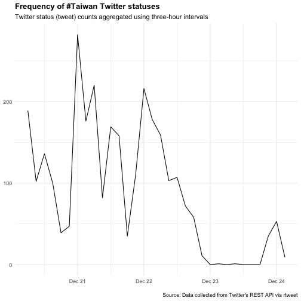

Pipelines For Data Analysis In R, part 2
========================================================
author: 曾意儒 Yi-Ju Tseng
autosize: true
font-family: 'Microsoft JhengHei'
navigation: slide

資料分析步驟
========================================================
- **資料匯入** 
- **資料清洗處理**並轉換為Tidy data
- 資料分析
- 資料呈現與視覺化

資料匯入
====================================
- 從檔案匯入
- 從網路匯入
- 從Twitter匯入
- 資料匯出

從檔案匯入
====================================
type:section
- Import Dataset功能 (RStudio)
- R物件 .rds
- R程式 .R
- 純文字資料 (無分隔)
- 其他格式

Import Dataset功能 (RStudio)
====================================
選取RStudio四分割視窗右上角的Environment標籤，選擇**Import Dataset**


Import Dataset功能 (RStudio)
====================================
- 選取`From CSV`
- 點選`Browse`按鈕開啟檔案選取器


Import Dataset功能 (RStudio)
====================================
- 利用下方`Import Options`的選項微調參數
    - `Delimiter`分隔符號
    - `First Row as Names`首列是否為欄位名稱
    


Import Dataset功能 (RStudio)
====================================
type:alert
incremental:true

- 操作[範例檔案](https://raw.githubusercontent.com/CGUIM-BigDataAnalysis/BigDataCGUIM/master/EMBA_BigData/f_lvr_land_a.csv)
- 若匯入的檔案為**tab分隔文字檔**? 該如何調整參數？


R物件 .rds
====================================
type:sub-section
如果在R程式內處理完資料後，必須儲存一份以供後續分析，使用R物件儲存是最佳的方式

- 檔案小
- 讀取快速
- 推薦使用`readRDS()`函數讀取RDS檔案
- [A better way of saving and loading objects in R](http://www.fromthebottomoftheheap.net/2012/04/01/saving-and-loading-r-objects/)

```r
dataset <- readRDS("檔案路徑與名稱")
```

R程式 .R
====================================
type:sub-section
- `source`函數
- 讀R的Obejct or script, **執行**
- **實際操作範例**
    - 有一份example.R檔在工作環境中
    - 一次執行檔案內所有R指令

```r
source("example.R") 
```

純文字資料 (無分隔)
====================================
type:sub-section
`readLines`, 逐行讀取文字資料

從網路匯入
====================================
type:section

- Open Data
- XML 可延伸標記式語言
- 網頁爬蟲 Webscraping
- API (Application programming interfaces)
- JSON格式檔案

Open Data 開放資料
====================================
type:sub-section
- 2011年推動開放政府與開放資料 ([維基百科](https://zh.wikipedia.org/wiki/%E9%96%8B%E6%94%BE%E8%B3%87%E6%96%99))
- 不受著作權、專利權，以及其他管理機制所限制，任何人都可以自由出版使用
- 常見的儲存方式為: 
    - `CSV`
    - `JSON`
    - `XML`
    
Open Data 開放資料常見平台
====================================
- [政府資料開放平台](http://data.gov.tw/)
- [Data Taipei](http://data.taipei/)
- [開放資料 x 開放桃園](http://data.tycg.gov.tw/)
- [內政資料開放平台](http://data.moi.gov.tw/)

XML 可延伸標記式語言
====================================
type:sub-section

- E**x**tensible **m**arkup **l**anguage
- 描述**結構化**資料的語言
- 處理XML檔案是網頁**Html**爬蟲的基礎
- Components
    - Markup 標記 - labels that give the text structure
    - Content 內文 - the actual text of the document
- [XML Wiki](https://zh.wikipedia.org/wiki/XML)

XML 可延伸標記式語言
====================================
Tags, elements and attributes

- Tags correspond to general labels
    - Start tags `<breakfast_menu>`, `<price>`
    - End tags `</breakfast_menu>`,`</price>`
    - Empty tags `<line-break />`
- Elements are specific examples of tags
    - `<name>Belgian Waffles</name>`
- Attributes are components of the label
    - `<book category="web">`
    
XML 可延伸標記式語言-讀取
====================================
- [空氣品質指標(AQI)](https://data.epa.gov.tw/api/v1/aqx_p_432?limit=1000&api_key=9be7b239-557b-4c10-9775-78cadfc555e9&format=xml)
- 安裝`xml2` package
- `xmlParse()`函數將XML檔案匯入


```r
library(xml2)
AQIURL<-"https://data.epa.gov.tw/api/v1/aqx_p_432?limit=1000&api_key=9be7b239-557b-4c10-9775-78cadfc555e9&format=xml"
AQIXML <- read_xml(AQIURL)
```

xpath?
====================================
- XML路徑語言（XML Path Language）
- 基於XML的樹狀結構，提供在資料結構樹中找尋節點的能力
- [維基百科](https://zh.wikipedia.org/wiki/XPath)
- [常見語法](http://tech-marsw.logdown.com/blog/2016/01/11/parsing-lxml-xpath-sheet)

XML 可延伸標記式語言-解析
====================================
使用`xml_find_all()`以及`xml_text()`函數取得指定標籤內的資料

```r
#取得所有"code_name"標籤內的資料
code_name_xml<-xml_find_all(AQIXML, ".//SiteName")
code_name<-xml_text(code_name_xml)
code_name[1:10]
```

```
 [1] "基隆" "汐止" "萬里" "新店" "土城" "板橋" "新莊" "菜寮" "林口" "淡水"
```

XML 可延伸標記式語言-解析
====================================
使用`xml_find_all()`以及`xml_text()`函數取得指定標籤內的資料

```r
#取得各監測站的經度longitude
longitude_xml<-xml_find_all(AQIXML, ".//Longitude")
longitude<-xml_text(longitude_xml)
longitude[1:10]
```

```
 [1] "121.760056" "121.6423"   "121.689881" "121.537778" "121.451861"
 [6] "121.458667" "121.4325"   "121.481028" "121.376869" "121.449239"
```

XML檔案匯入練習
====================================
type:alert
incremental:true
- 載入[農產品交易行情](https://data.coa.gov.tw/Service/OpenData/FromM/FarmTransData.aspx?FOTT=Xml)
- 嘗試取得各筆交易的作物名稱與平均價
- 參考剛剛的AQI範例

```r
library(xml2)
AQIURL<-"https://data.epa.gov.tw/api/v1/aqx_p_432?limit=1000&api_key=9be7b239-557b-4c10-9775-78cadfc555e9&format=xml"
AQIXML <- read_xml(AQIURL)
code_name_xml<-xml_find_all(AQIXML, ".//SiteName")
code_name<-xml_text(code_name_xml)
code_name[1:10]
```


API
====================================
type:sub-section
- 應用程式介面
- **A**pplication **P**rogramming **I**nterfaces
- 為了讓第三方的開發者可以額外開發應用程式來強化他們的產品，推出可以與系統溝通的介面
- 有API輔助可將資料擷取過程自動化
    -  以下載Open Data為例，若檔案更新頻繁，使用手動下載相當耗時
- [維基百科](https://zh.wikipedia.org/zh-tw/%E5%BA%94%E7%94%A8%E7%A8%8B%E5%BA%8F%E6%8E%A5%E5%8F%A3)

API - Open Data
====================================
- [桃園公共自行車即時服務資料](http://data.tycg.gov.tw/opendata/datalist/datasetMeta?oid=5ca2bfc7-9ace-4719-88ae-4034b9a5a55c)資料
- 每日更新
- 不可能每日手動下載
- 提供透過**API**下載的服務
- 透過API下載的資料格式: **JSON格式**

***

- [桃園公共自行車即時服務資料API資訊](http://data.tycg.gov.tw/opendata/datalist/datasetMeta/outboundDesc?id=5ca2bfc7-9ace-4719-88ae-4034b9a5a55c&rid=a1b4714b-3b75-4ff8-a8f2-cc377e4eaa0f)
    - **資料集ID**: 紀錄資料的基本參數，如包含欄位、更新頻率等
    - **資料RID**: 資料集
    - 擷取範例


JSON格式檔案
====================================
type:sub-section

- JSON (**J**ava**s**cript **O**bject **N**otation)
- 輕量級的資料交換語言
- From **a**pplication **p**rogramming **i**nterfaces (APIs)
- JavaScript、Java、Node.js應用
- 一些NoSQL資料庫用JSON儲存資料：**MongoDB**
- [Wiki](http://en.wikipedia.org/wiki/JSON)


JSON檔案匯入
====================================
- `jsonlite` package (套件使用前必須安裝)
- `fromJSON()`函數載入JSON資料
- 如果API網址為**https**，則需使用 `httr` package
    - 使用`GET()`函數處理資料擷取網址
- API網址參考[桃園公共自行車即時服務資料API資訊](http://data.tycg.gov.tw/opendata/datalist/datasetMeta/outboundDesc?id=5ca2bfc7-9ace-4719-88ae-4034b9a5a55c&rid=a1b4714b-3b75-4ff8-a8f2-cc377e4eaa0f)

```r
library(jsonlite)
library(RCurl)
APIData<-fromJSON("http://data.tycg.gov.tw/api/v1/rest/datastore/a1b4714b-3b75-4ff8-a8f2-cc377e4eaa0f?format=json")
```

JSON檔案匯入
====================================
- 轉存為`列表list`的型態
- 兩個子元素(success, result)
- result中records子元素的類別為資料框data.frame

```r
str(APIData)
```

JSON檔案解析
====================================
- 使用`$`符號截取元素與子元素

```r
head(APIData$result$records)
```


JSON檔案解析
====================================
分析各項**地區**車站數

```r
table(APIData$result$records$sarea)
```

分析可知中壢區車站較多


JSON檔案匯入練習
====================================
type:alert
incremental:true

- 練習用資料：[「空氣品質資料」API存取](https://data.epa.gov.tw/api/v1/aqx_p_432?limit=1000&api_key=9be7b239-557b-4c10-9775-78cadfc555e9&format=json)
- 使用檔案匯入**範例**，將資料匯入R中
    - 提示：**fromJSON**
- 使用str()函數觀察匯入的資料
- 請問有幾筆觀察值？幾個欄位？


網頁爬蟲 Webscraping
====================================
type:sub-section

- 不是每個網站都提供API
- 人工複製貼上?!
- 程式化的方式擷取網頁資料: **網頁爬蟲（Webscraping）**（[Webscraping Wiki](http://en.wikipedia.org/wiki/Web_scraping)）
- 可能耗費很多網頁流量和資源 －很可能被鎖IP
- 在R的處理辦法
    - 當作XML檔案處理分析
    - 使用`rvest` package輔助

網頁爬蟲 Webscraping-rvest
====================================

載入[rvest](https://github.com/hadley/rvest)套件後，經由以下步驟進行網站解析：

- 使用`read_html(“欲擷取的網站網址”)`函數讀取網頁
- 使用`html_nodes()`函數擷取所需內容 (條件為CSS或xpath標籤)
- 使用`html_text()`函數處理/清洗擷取內容，留下需要的資料
- 使用`html_attr()`函數擷取資料參數（如連結url）

網頁爬蟲 Webscraping-rvest
====================================

```r
library(rvest) ##載入
Repoterurl<-"https://www.twreporter.org/topics"
Repoterhtml<-read_html(Repoterurl)
news_title <- Repoterhtml %>% 
    html_nodes(".kmupWO") %>% html_text()
news_title
```

```
[1] "健保的崩時代"                              
[2] "金馬57｜最好的時光：點亮世界的電影夢"      
[3] "國際搶工與人權大浪來襲"                    
[4] "強光下的暗憂──背負情緒隱傷的高學業成就青年"
[5] "港人移台進行式──移民浪潮下的台港新地景"    
```


網頁爬蟲 Webscraping-rvest
====================================
- 擷取條件的撰寫會因網頁語法不同而有差異
- 使用**Google Chrome開發工具**輔助觀察擷取資料的條件
    - 或使用**SelectorGadget**輔助
    - 或使用**xpath-helper**輔助xpath標籤的擷取
- 觀察需要擷取的資料所在HTML片段
    - css class為`.kmupWO`


盤中奈米股資料爬取 -1
====================================
[零股資料](https://fubon-ebrokerdj.fbs.com.tw/z/ze/zeg/zega_EBTW50E_I.djhtm)

```r
library(rvest) 
NanoStockUrl<-"https://fubon-ebrokerdj.fbs.com.tw/z/ze/zeg/zega_EBTW50E_I.djhtm"
NanoStockContent<-read_html(NanoStockUrl)
NanoStockName<-
  NanoStockContent %>% html_nodes("#oAddCheckbox") %>% 
    html_text()
NanoStockPrice<-
  NanoStockContent %>% html_nodes(".t3n1")%>% 
    html_text()

head(NanoStockName)
```

```
[1] "\r\n\r\n<!--\r\n\tGenLink2stk('AS1101','台泥');\r\n//-->\r\n"
[2] "\r\n\r\n<!--\r\n\tGenLink2stk('AS1102','亞泥');\r\n//-->\r\n"
[3] "\r\n\r\n<!--\r\n\tGenLink2stk('AS1216','統一');\r\n//-->\r\n"
[4] "\r\n\r\n<!--\r\n\tGenLink2stk('AS1301','台塑');\r\n//-->\r\n"
[5] "\r\n\r\n<!--\r\n\tGenLink2stk('AS1303','南亞');\r\n//-->\r\n"
[6] "\r\n\r\n<!--\r\n\tGenLink2stk('AS1326','台化');\r\n//-->\r\n"
```

```r
head(NanoStockPrice)
```

```
[1] "43.65"     "36,842"    "77"        "43.65"     "25,468"    "1,609,507"
```

盤中奈米股資料爬取 -2
====================================

```r
NanoStockPriceTable<-
  matrix(NanoStockPrice,ncol=6, byrow=TRUE)
NanoStockNameClean<-gsub('\\r|<|!|\\n|\\t|GenLink2stk|;|/|-|>',
                         '',
                         NanoStockName)
NanoStockData <- 
    data.frame(name = NanoStockNameClean,
               NanoStockPriceTable)
```

盤中奈米股資料爬取 -3
====================================

```r
NanoStockData
```

|name                    |X1       |X2      |X3 |X4       |X5      |X6          |
|:-----------------------|:--------|:-------|:--|:--------|:-------|:-----------|
|('AS1101','台泥')       |43.65    |36,842  |77 |43.65    |25,468  |1,609,507   |
|('AS1102','亞泥')       |44.00    |6,036   |27 |43.95    |3,672   |265,005     |
|('AS1216','統一')       |66.60    |20,582  |68 |66.40    |7,164   |1,366,706   |
|('AS1301','台塑')       |89.50    |34,737  |81 |89.20    |11,347  |3,100,612   |
|('AS1303','南亞')       |67.60    |20,121  |69 |67.50    |10,665  |1,360,052   |
|('AS1326','台化')       |80.20    |14,507  |56 |80.00    |6,161   |1,160,607   |
|('AS1402','遠東新')     |27.60    |6,055   |25 |27.80    |2,530   |167,182     |
|('AS2002','中鋼')       |23.30    |66,588  |81 |23.30    |51,339  |1,553,009   |
|('AS2105','正新')       |43.65    |6,436   |27 |43.55    |4,621   |280,309     |
|('AS2207','和泰車')     |665.00   |2,162   |39 |662.00   |40      |1,431,548   |
|('AS2301','光寶科')     |49.30    |9,130   |43 |49.20    |6,025   |449,923     |
|('AS2303','聯電')       |47.60    |422,036 |88 |47.60    |431,081 |19,596,973  |
|('AS2308','台達電')     |247.00   |40,846  |87 |247.00   |8,116   |10,020,433  |
|('AS2317','鴻海')       |82.80    |128,963 |87 |82.80    |78,163  |10,683,332  |
|('AS2327','國巨')       |460.50   |38,563  |83 |460.00   |6,632   |17,718,094  |
|('AS2330','台積電')     |504.00   |461,197 |88 |503.00   |71,005  |231,160,849 |
|('AS2357','華碩')       |251.50   |16,418  |64 |250.00   |6,187   |4,107,251   |
|('AS2379','瑞昱')       |379.50   |10,569  |64 |381.50   |1,958   |4,008,938   |
|('AS2382','廣達')       |78.60    |16,827  |63 |79.00    |11,804  |1,316,201   |
|('AS2395','研華')       |315.00   |3,321   |47 |313.00   |1,492   |1,043,174   |
|('AS2408','南亞科')     |87.50    |42,298  |84 |87.50    |13,959  |3,722,218   |
|('AS2412','中華電')     |109.00   |16,361  |59 |109.00   |9,065   |1,784,039   |
|('AS2454','聯發科')     |703.00   |49,523  |87 |705.00   |8,397   |34,776,040  |
|('AS2474','可成')       |197.50   |16,305  |63 |198.50   |2,842   |3,210,032   |
|('AS2633','台灣高鐵')   |31.60    |12,415  |45 |31.65    |3,581   |393,075     |
|('AS2801','彰銀')       |17.70    |12,182  |37 |17.75    |17,691  |215,807     |
|('AS2880','華南金')     |18.20    |44,885  |73 |18.20    |35,704  |814,771     |
|('AS2881','富邦金')     |45.10    |15,544  |57 |45.05    |10,562  |695,789     |
|('AS2882','國泰金')     |40.65    |26,127  |69 |40.65    |19,837  |1,058,334   |
|('AS2883','開發金')     |8.99     |22,919  |59 |8.98     |28,070  |205,722     |
|('AS2884','玉山金')     |25.35    |85,156  |86 |25.40    |49,737  |2,161,260   |
|('AS2885','元大金')     |19.40    |46,197  |79 |19.40    |57,533  |892,733     |
|('AS2886','兆豐金')     |29.20    |47,820  |75 |29.20    |13,398  |1,397,060   |
|('AS2887','台新金')     |13.30    |33,000  |70 |13.25    |26,750  |437,417     |
|('AS2890','永豐金')     |11.25    |18,582  |50 |11.25    |17,746  |209,175     |
|('AS2891','中信金')     |19.55    |33,983  |73 |19.55    |21,463  |663,693     |
|('AS2892','第一金')     |21.40    |45,900  |77 |21.35    |32,053  |980,004     |
|('AS2912','統一超')     |268.50   |9,022   |61 |269.00   |1,556   |2,425,140   |
|('AS3008','大立光')     |3,425.00 |19,835  |88 |3,440.00 |2,293   |67,828,710  |
|('AS3045','台灣大')     |98.00    |16,574  |58 |98.00    |3,720   |1,624,756   |
|('AS3711','日月光投控') |79.50    |47,085  |77 |79.60    |21,995  |3,728,508   |
|('AS4904','遠傳')       |61.10    |8,965   |39 |61.00    |2,979   |547,297     |
|('AS4938','和碩')       |66.30    |12,641  |46 |66.40    |5,852   |840,373     |
|('AS5871','中租KY')     |159.50   |11,295  |57 |160.00   |1,810   |1,801,772   |
|('AS5876','上海商銀')   |40.15    |5,869   |29 |40.20    |1,505   |235,547     |
|('AS5880','合庫金')     |20.30    |35,586  |77 |20.30    |28,470  |720,524     |
|('AS6415','矽力KY')     |2,335.00 |1,341   |38 |2,350.00 |350     |3,118,535   |
|('AS6505','台塑化')     |94.70    |6,456   |50 |94.70    |2,496   |609,840     |
|('AS6669','緯穎')       |676.00   |11,577  |72 |678.00   |1,359   |7,728,981   |
|('AS9910','豐泰')       |188.50   |3,963   |18 |188.00   |2,551   |745,463     |

    
爬蟲練習
====================================
type:alert

- [Ptt Tech_Job 版](https://www.ptt.cc/bbs/Tech_Job/index.html)
- 試著爬出所有**標題**
- 爬出的第三個標題是？


網頁爬蟲 再想想？
====================================
incremental:true

- 其實... 很多資料有其他存取方式，像API
    - https://www.dcard.tw/_api/forums/cgu/posts
    - https://www.dcard.tw/_api/posts/225917717
    - https://www.dcard.tw/_api/posts/225917717/comments
- 隱私問題 （OkCupid事件）
    - [70,000 OkCupid Users Just Had Their Data Published](https://motherboard.vice.com/en_us/article/70000-okcupid-users-just-had-their-data-published)

進階爬蟲
====================================
- CSS Selector 語法介紹 [參考資料](https://www.w3schools.com/cssref/css_selectors.asp)
    - **.**xxx：select elements with class="xxx"
    - **#**xxx：select elements with id="xxx"
    - **[**yyy**]**：select elements with attribute yyy
    - **[**yyy=zzz**]**：select elements with attribute yyy="zzz"
    
- 瀑布式網頁爬蟲
    - 觀察Google Chrome 開發者工具，在Network內找到api呼叫方式
    - 搭配使用RSelenium 模擬瀏覽狀態 [DCard實作R Code](https://github.com/CGUIM-BigDataAnalysis/BigDataCGUIM/blob/master/105/RSelenium_rvest.md)


其他爬蟲相關參考資源
====================================
- [網路爬蟲實作 - 用 r 語言打造自己的爬蟲程式](https://www.slideshare.net/secret/mdfHLPgvIW1kPR)
- [rvest GitHub](https://github.com/hadley/rvest)
- R Bloggers 有很多[爬蟲範例](http://www.r-bloggers.com/?s=Web+Scraping)（英文）
- [Ptt爬蟲實作](http://bryannotes.blogspot.tw/2014/08/r-ptt-wantedsocial-network-analysis.html)
- [大數學堂 網頁爬蟲課程](http://www.largitdata.com/course_list/1)


從Facebook匯入
====================================
type:section
- Graph API in R
- Rfacebook package

Graph API in R
====================================
type:sub-section

- 在2018年的風波後，Graph API若要用在爬取公開粉專，須經過FB審核
- [Graph API](https://developers.facebook.com/docs/graph-api?locale=zh_TW)
    - 根據篩選條件，回傳JSON格式的資料
- [Graph API Explorer](https://developers.facebook.com/tools/explorer/)
    - 測試資料撈取方法和結果
- 必須要取得自己的**access token** (存取權杖)
    - 可在[Graph API Explorer](https://developers.facebook.com/tools/explorer/)視窗右上角的**Get Token**按鈕取得
    - [官方文件](https://developers.facebook.com/docs/facebook-login/access-tokens/?locale=zh_TW)


Rfacebook package
====================================
type:sub-section
在2018年的風波後，Graph API若要用在爬取公開粉專，須經過FB審核，因此本課程目前無法示範粉絲專頁爬取

使用 Rfacebook 取得 `tsaiingwen` 粉絲頁的資料

```r
library(Rfacebook) #初次使用須先安裝
token<-"your token" #將token複製到此處
getPage("tsaiingwen", token,n = 5)
```
若經過審核，可得下列結果

```
4 posts       from_id           from_name
1 46251501064 蔡英文 Tsai Ing-wen
2 46251501064 蔡英文 Tsai Ing-wen
3 46251501064 蔡英文 Tsai Ing-wen
4 46251501064 蔡英文 Tsai Ing-wen
```

從Twitter匯入
====================================
type:section
- Twitter API
- rtweet package

Twitter API
====================================
- https://developer.twitter.com/en/apps
- 需有Twitter帳號並通過開發者審核

rtweet package
====================================

```r
## install rtweet from CRAN
install.packages("rtweet")
## load rtweet package
library(rtweet)
```

rtweet package - token 設定
====================================

```r
library(rtweet)
create_token(
  app = "teach0309",
  consumer_key = "Wbba6ysyPKGstGAqohmtyWZOE",
  consumer_secret = "GJweDzVvXGrbjz26bHTr3d6dFI7q9gFCH98f3Ct2yk3APPWigc",
  access_token = "216362944-AxxvSiPBR7nBScfBks7thajSovUwFG6v67aNR3WP",
  access_secret = "pF0OldOjiJxaBbPlQhx7V3VkA6MIgdzHHofar1DM0pX0G")
```

```
<Token>
<oauth_endpoint>
 request:   https://api.twitter.com/oauth/request_token
 authorize: https://api.twitter.com/oauth/authenticate
 access:    https://api.twitter.com/oauth/access_token
<oauth_app> teach0309
  key:    Wbba6ysyPKGstGAqohmtyWZOE
  secret: <hidden>
<credentials> oauth_token, oauth_token_secret
---
```

rtweet package - 搜尋hashtag
====================================

```r
## search for 3000 tweets using the trump hashtag
rt <- search_tweets(
  "#trump", n = 3000, include_rts = FALSE
)
head(rt)
```

|user_id             |status_id           |created_at          |screen_name     |
|:-------------------|:-------------------|:-------------------|:---------------|
|801851390           |1334851267043069954 |2020-12-04 13:25:17 |BrettKallio     |
|930060686           |1334851258906079236 |2020-12-04 13:25:15 |TheInsolentbard |
|22657914            |1334851227776114689 |2020-12-04 13:25:07 |patcondell      |
|1221788022334726144 |1334851208587120641 |2020-12-04 13:25:03 |tce_exchangeNL  |
|1328039917843337222 |1334851207534424067 |2020-12-04 13:25:02 |MaximonoticiasE |
|903487039235960832  |1334851148780593156 |2020-12-04 13:24:48 |D09872          |

rtweet package - 搜尋hashtag
====================================


rtweet package - 取得趨勢
====================================

```r
sf <- get_trends("USA")
head(sf)
```

|trend        |url                                      |promoted_content |query        |
|:------------|:----------------------------------------|:----------------|:------------|
|#Belarus     |http://twitter.com/search?q=%23Belarus   |NA               |%23Belarus   |
|The UK       |http://twitter.com/search?q=%22The+UK%22 |NA               |%22The+UK%22 |
|Portugal     |http://twitter.com/search?q=Portugal     |NA               |Portugal     |
|Nebelspalter |http://twitter.com/search?q=Nebelspalter |NA               |Nebelspalter |

rtweet package - 取得timeline
====================================

```r
tmls <- get_timelines(c("realDonaldTrump", "joebiden"), n = 3000)
head(tmls)
```

|user_id  |screen_name     |text                                                                                                                                                                                                                                                                               |source             |
|:--------|:---------------|:----------------------------------------------------------------------------------------------------------------------------------------------------------------------------------------------------------------------------------------------------------------------------------|:------------------|
|25073877 |realDonaldTrump |LOL keep the Senate red! “The bipartisan legislation not only omits language about Section 230, but also includes a provision that Trump opposes and has prompted a separate previous veto threat: renaming military bases which bear a Confederate name.” https://t.co/cuhjjpKIao |Twitter for iPhone |
|25073877 |realDonaldTrump |Whistleblowers reveal that the USPS is responsible for tampering with hundreds of thousands of ballots. @OANN  This long time Democrat stronghold got rid of massive numbers, especially in swing states, during and before delivery of the ballots. Well documented evidence!     |Twitter for iPhone |
|25073877 |realDonaldTrump |Big Rally Saturday Night in Georgia!!!                                                                                                                                                                                                                                             |Twitter for iPhone |
|25073877 |realDonaldTrump |A great person who did a fantastic job. Thank you Alyssa! https://t.co/TEWiYEGnJO                                                                                                                                                                                                  |Twitter for iPhone |
|25073877 |realDonaldTrump |@JimInhofe What good is having a very expensive National Defense Authorization Act if Big Tech can run circles around you and the security of our Country? End Section 230 now! #NDAA                                                                                              |Twitter for iPhone |
|25073877 |realDonaldTrump |But doesn’t get rid of Big Tech’s windfall, Section 230, a grave threat to National Security. I will VETO! https://t.co/QI7BfNc7hb                                                                                                                                                 |Twitter for iPhone |

rtweet package - 取得timeline
====================================


rtweet package - 取得followers
====================================

```r
## get user IDs of accounts following 蔡英文 Tsai Ing-wen
iingwen_flw <- get_followers("iingwen", n = 1000)
## lookup data on those accounts
iingwen_flw_data <- lookup_users(iingwen_flw$user_id)
head(iingwen_flw_data)
```


rtweet package練習
====================================
type:alert
incremental:true
- 複製老師的Twitter access token
- 使用rtweet package取得**蔡英文 Tsai Ing-wen**(iingwen)的timeline，共50筆tweets
- 第一筆資料的retweet_count是多少?
- 第二筆資料的favorite_count是多少?


資料匯出
====================================
type:section
- 文字檔 .txt
- CSV檔 .csv
- R物件 .rds


文字檔 .txt write.table()
====================================
type:sub-section


```r
write.table(iris,file="iris.txt",sep=",",
            row.names = F,col.names = T)
```
- 要匯出的資料
- `file` 檔案名稱
- `append` T/F T:在檔案後加字，F:直接覆蓋檔案 (預設F)
- `quote` 是否需要用雙引號將字串包起 (預設T)
- `sep` 分隔符號 (預設空白)
- `row.names` T/F 是否需要輸出row names
- `col.names` T/F 是否需要輸出column names
- `fileEncoding` 編碼設定


CSV檔 .csv
====================================
type:sub-section

與`write.table()`類似，使用`write.csv()`函數寫入檔案

```r
write.csv(iris,file="iris.csv",row.names = F)
```

R物件 .rds
====================================
type:sub-section

若是要在R的環境繼續使用，建議匯出成R物件檔案(.rds)

```r
saveRDS(iris,"iris.rds")
```


資料清洗與處理
====================================
- Tidy Data
- 資料型別轉換處理
- 文字字串處理
- 子集Subset
- 排序
- 資料組合
- 長表與寬表

Tidy Data
====================================
type:sub-section 

Each column is a variable. Each row is an observation.

- 一個欄位（Column）內只有一個數值，最好要有凡人看得懂的Column Name
- 不同的觀察值應該要在不同行（Row）
- 一張表裡面，有所有分析需要的資料
- 如果一定要多張表，中間一定要有index可以把表串起來
- One file, one table

資料型別轉換處理
====================================
type:sub-section 
包括**資料型別檢查**與**資料型別轉換**

資料型別:

- 數值 (numeric)
- 字串 (character)
- 布林變數 (logic)
- 日期 (Date)


資料型別檢查 - is.
====================================
使用`is.`函數檢查資料型別，回傳布林變數，若為**真**，回傳**TRUE**

- 是否為**數字** `is.numeric(變數名稱)`
- 是否為**文字** `is.character(變數名稱)`
- 是否為**布林變數** `is.logical(變數名稱)`


```r
num<-100
is.numeric(num)
```

```
[1] TRUE
```

```r
is.character(num)
```

```
[1] FALSE
```

資料型別檢查 - class()
====================================
使用`class(變數名稱)`函數，直接回傳**資料型別**

```r
class(num)
```

```
[1] "numeric"
```

```r
class(Sys.Date())
```

```
[1] "Date"
```


資料型別轉換 - as.
====================================

使用`as.`函數轉換型別

- 轉換為**數字** `as.numeric(變數名稱)`
- 轉換為**文字** `as.character(變數名稱)`
- 轉換為**布林變數** `as.logical(變數名稱)`


```r
cha<-"100"
as.numeric(cha)
```

```
[1] 100
```

資料型別轉換 - as.
====================================

若無法順利完成轉換，會回傳空值`NA`，並出現警告訊息

```r
as.numeric("abc")
```

```
[1] NA
```


資料型別轉換練習
====================================
type:alert
回想起奈米股盤中交易的資料．．．

```r
library(rvest) 
NanoStockUrl<-"https://fubon-ebrokerdj.fbs.com.tw/z/ze/zeg/zega_EBTW50E_I.djhtm"
NanoStockContent<-read_html(NanoStockUrl)
NanoStockName<-
  NanoStockContent %>% html_nodes("#oAddCheckbox") %>% 
    html_text()
NanoStockPrice<-
  NanoStockContent %>% html_nodes(".t3n1")%>% 
    html_text()
NanoStockPriceTable<-
  matrix(NanoStockPrice,ncol=6, byrow=TRUE)
NanoStockNameClean<-gsub('\\r|<|!|\\n|\\t|GenLink2stk|;|/|-|>',
                         '',
                         NanoStockName)
NanoStockData <- 
    data.frame(name = NanoStockNameClean,
               NanoStockPriceTable)
knitr::kable(NanoStockData) 
```


|name                    |X1       |X2      |X3 |X4       |X5      |X6          |
|:-----------------------|:--------|:-------|:--|:--------|:-------|:-----------|
|('AS1101','台泥')       |43.65    |36,842  |77 |43.65    |25,468  |1,609,507   |
|('AS1102','亞泥')       |44.00    |6,036   |27 |43.95    |3,672   |265,005     |
|('AS1216','統一')       |66.60    |20,582  |68 |66.40    |7,164   |1,366,706   |
|('AS1301','台塑')       |89.50    |34,737  |81 |89.20    |11,347  |3,100,612   |
|('AS1303','南亞')       |67.60    |20,121  |69 |67.50    |10,665  |1,360,052   |
|('AS1326','台化')       |80.20    |14,507  |56 |80.00    |6,161   |1,160,607   |
|('AS1402','遠東新')     |27.60    |6,055   |25 |27.80    |2,530   |167,182     |
|('AS2002','中鋼')       |23.30    |66,588  |81 |23.30    |51,339  |1,553,009   |
|('AS2105','正新')       |43.65    |6,436   |27 |43.55    |4,621   |280,309     |
|('AS2207','和泰車')     |665.00   |2,162   |39 |662.00   |40      |1,431,548   |
|('AS2301','光寶科')     |49.30    |9,130   |43 |49.20    |6,025   |449,923     |
|('AS2303','聯電')       |47.60    |422,036 |88 |47.60    |431,081 |19,596,973  |
|('AS2308','台達電')     |247.00   |40,846  |87 |247.00   |8,116   |10,020,433  |
|('AS2317','鴻海')       |82.80    |128,963 |87 |82.80    |78,163  |10,683,332  |
|('AS2327','國巨')       |460.50   |38,563  |83 |460.00   |6,632   |17,718,094  |
|('AS2330','台積電')     |504.00   |461,197 |88 |503.00   |71,005  |231,160,849 |
|('AS2357','華碩')       |251.50   |16,418  |64 |250.00   |6,187   |4,107,251   |
|('AS2379','瑞昱')       |379.50   |10,569  |64 |381.50   |1,958   |4,008,938   |
|('AS2382','廣達')       |78.60    |16,827  |63 |79.00    |11,804  |1,316,201   |
|('AS2395','研華')       |315.00   |3,321   |47 |313.00   |1,492   |1,043,174   |
|('AS2408','南亞科')     |87.50    |42,298  |84 |87.50    |13,959  |3,722,218   |
|('AS2412','中華電')     |109.00   |16,361  |59 |109.00   |9,065   |1,784,039   |
|('AS2454','聯發科')     |703.00   |49,523  |87 |705.00   |8,397   |34,776,040  |
|('AS2474','可成')       |197.50   |16,305  |63 |198.50   |2,842   |3,210,032   |
|('AS2633','台灣高鐵')   |31.60    |12,415  |45 |31.65    |3,581   |393,075     |
|('AS2801','彰銀')       |17.70    |12,182  |37 |17.75    |17,691  |215,807     |
|('AS2880','華南金')     |18.20    |44,885  |73 |18.20    |35,704  |814,771     |
|('AS2881','富邦金')     |45.10    |15,544  |57 |45.05    |10,562  |695,789     |
|('AS2882','國泰金')     |40.65    |26,127  |69 |40.65    |19,837  |1,058,334   |
|('AS2883','開發金')     |8.99     |22,919  |59 |8.98     |28,070  |205,722     |
|('AS2884','玉山金')     |25.35    |85,156  |86 |25.40    |49,737  |2,161,260   |
|('AS2885','元大金')     |19.40    |46,197  |79 |19.40    |57,533  |892,733     |
|('AS2886','兆豐金')     |29.20    |47,820  |75 |29.20    |13,398  |1,397,060   |
|('AS2887','台新金')     |13.30    |33,000  |70 |13.25    |26,750  |437,417     |
|('AS2890','永豐金')     |11.25    |18,582  |50 |11.25    |17,746  |209,175     |
|('AS2891','中信金')     |19.55    |33,983  |73 |19.55    |21,463  |663,693     |
|('AS2892','第一金')     |21.40    |45,900  |77 |21.35    |32,053  |980,004     |
|('AS2912','統一超')     |268.50   |9,022   |61 |269.00   |1,556   |2,425,140   |
|('AS3008','大立光')     |3,425.00 |19,835  |88 |3,440.00 |2,293   |67,828,710  |
|('AS3045','台灣大')     |98.00    |16,574  |58 |98.00    |3,720   |1,624,756   |
|('AS3711','日月光投控') |79.50    |47,085  |77 |79.60    |21,995  |3,728,508   |
|('AS4904','遠傳')       |61.10    |8,965   |39 |61.00    |2,979   |547,297     |
|('AS4938','和碩')       |66.30    |12,641  |46 |66.40    |5,852   |840,373     |
|('AS5871','中租KY')     |159.50   |11,295  |57 |160.00   |1,810   |1,801,772   |
|('AS5876','上海商銀')   |40.15    |5,869   |29 |40.20    |1,505   |235,547     |
|('AS5880','合庫金')     |20.30    |35,586  |77 |20.30    |28,470  |720,524     |
|('AS6415','矽力KY')     |2,335.00 |1,341   |38 |2,350.00 |350     |3,118,535   |
|('AS6505','台塑化')     |94.70    |6,456   |50 |94.70    |2,496   |609,840     |
|('AS6669','緯穎')       |676.00   |11,577  |72 |678.00   |1,359   |7,728,981   |
|('AS9910','豐泰')       |188.50   |3,963   |18 |188.00   |2,551   |745,463     |

資料型別轉換練習
====================================
type:alert
成交股數、總成交值都是字串型別 (chr)

```r
str(NanoStockData)
```

```
'data.frame':	50 obs. of  7 variables:
 $ name: Factor w/ 50 levels "('AS1101','台泥')",..: 1 2 3 4 5 6 7 8 9 10 ...
 $ X1  : Factor w/ 49 levels "109.00","11.25",..: 27 28 36 47 38 44 19 14 27 37 ...
 $ X2  : Factor w/ 50 levels "1,341","10,569",..: 29 42 20 27 19 9 43 46 44 18 ...
 $ X3  : Factor w/ 33 levels "18","25","27",..: 26 3 20 28 21 13 2 28 3 7 ...
 $ X4  : Factor w/ 49 levels "109.00","11.25",..: 28 29 36 47 38 44 19 14 27 37 ...
 $ X5  : Factor w/ 50 levels "1,359","1,492",..: 24 29 45 9 8 42 18 39 34 35 ...
 $ X6  : Factor w/ 50 levels "1,043,174","1,058,334",..: 10 26 6 28 5 3 16 9 27 8 ...
```
該如何將這兩個欄位轉成數字呢？

文字字串處理
====================================
type:sub-section 

- 基本處理
- 搜尋字串
- [Regular Expression 正規表示式 @ R](https://github.com/CGUIM-BigDataAnalysis/BigDataCGUIM/blob/master/105/RegularExpression.md)

基本處理
====================================

- 切割 `strsplit()` **Split**
- 子集 `substr()` **sub string**
- 大小寫轉換 `toupper()` `tolower()`
- 兩文字連接 `paste()` `paste0()`
- 文字取代 `gsub()` **substitute**
- 前後空白去除 `str_trim()` 需安裝`stringr` package **trim**

基本處理-切割
====================================
strsplit (欲切割的字串,用什麼符號切割)

```r
strsplit ("Hello World"," ")
```

```
[[1]]
[1] "Hello" "World"
```

基本處理-切割（多字元）|
====================================
strsplit (欲切割的字串,切割符號1|切割符號2|...)

```r
strsplit ("Hello World"," |o")
```

```
[[1]]
[1] "Hell" ""     "W"    "rld" 
```

基本處理-子集（切一小段）
====================================
substr(欲做子集的字串,開始位置,結束位置)

```r
substr("Hello World", start=2,stop=4)
```

```
[1] "ell"
```

基本處理-大小寫轉換
====================================

```r
toupper("Hello World")
```

```
[1] "HELLO WORLD"
```

```r
tolower("Hello World")
```

```
[1] "hello world"
```

基本處理-兩文字連接
====================================
paste(欲連接的字串1, 欲連接的字串2, 欲連接的字串3,.... sep=中間用什麼符號分隔)

```r
paste("Hello", "World")
```

```
[1] "Hello World"
```

```r
paste("Hello", "World", sep='')
```

```
[1] "HelloWorld"
```

```r
paste0("Hello", "World")
```

```
[1] "HelloWorld"
```

基本處理-文字取代
====================================
gsub(想要換掉的舊字串,想要換成的新字串,欲作取代的完整字串)

```r
gsub("o","0","Hello World")
```

```
[1] "Hell0 W0rld"
```

基本處理-文字取代（多字元）|
====================================
gsub(想要換掉的舊字串1|想要換掉的舊字串2|...,想要換成的新字串,欲作取代的完整字串)

```r
gsub("o|l","0","Hello World")
```

```
[1] "He000 W0r0d"
```

基本處理-前後空白去除
====================================
str_trim要使用前需要安裝與載入**stringr**套件

```r
library(stringr)
str_trim(" Hello World ")
```

```
[1] "Hello World"
```


搜尋字串
====================================
- 通常使用在**比對文字向量**
- **有分大小寫**
- 依照回傳值的型態不同，有兩種常用函數
    - 回傳符合條件之向量位置(index) `grep(搜尋條件,要搜尋的向量)`
    - 回傳每個向量是否符合條件(TRUE or FALSE) `grepl(搜尋條件,要搜尋的向量)`


```r
##在姓名文字向量中尋找A，回傳包含"A"之元素位置
grep("A",c("Alex","Tom","Amy","Joy","Emma")) 
```

```
[1] 1 3
```

搜尋字串 - grepl()
====================================

```r
##在姓名文字向量中尋找A，回傳各元素是否包含"A"
grepl("A",c("Alex","Tom","Amy","Joy","Emma")) 
```

```
[1]  TRUE FALSE  TRUE FALSE FALSE
```

```r
##在姓名文字向量中尋找a，回傳各元素是否包含"a"
grepl("a",c("Alex","Tom","Amy","Joy","Emma")) 
```

```
[1] FALSE FALSE FALSE FALSE  TRUE
```

搜尋字串 - grep()
====================================

```r
##在姓名文字向量中尋找A，回傳包含"A"的元素位置
grep("A",c("Alex","Tom","Amy","Joy","Emma")) 
```

```
[1] 1 3
```

```r
##在姓名文字向量中尋找a，回傳包含"a"的元素位置
grep("a",c("Alex","Tom","Amy","Joy","Emma")) 
```

```
[1] 5
```

搜尋字串 - grep()
====================================
type:alert
多字元？


子集Subset - 一維資料
====================================
type:sub-section 

之前有介紹使用`[ ]`取出單一或多個元素的方法

```r
letters ##R語言內建資料之一
```

```
 [1] "a" "b" "c" "d" "e" "f" "g" "h" "i" "j" "k" "l" "m" "n" "o" "p" "q" "r" "s"
[20] "t" "u" "v" "w" "x" "y" "z"
```

```r
letters[1] ##取出letters向量的第一個元素
```

```
[1] "a"
```

子集Subset - 一維資料
====================================

也可以用“負號”去掉不要的資料

```r
letters[c(1,3,5)] ##取出letters向量的第1,3,5個元素
```

```
[1] "a" "c" "e"
```

```r
letters[c(-1,-3,-5)] ##取出letters向量除了第1,3,5個元素之外的所有元素
```

```
 [1] "b" "d" "f" "g" "h" "i" "j" "k" "l" "m" "n" "o" "p" "q" "r" "s" "t" "u" "v"
[20] "w" "x" "y" "z"
```

子集Subset - 一維資料
====================================
若想要快速取得一向量的開頭與結尾元素，可使用`head()`和`tail()`函數

```r
head(letters,5) ##取出letters向量的前五個元素
```

```
[1] "a" "b" "c" "d" "e"
```

```r
tail(letters,3) ##取出letters向量的後三個元素
```

```
[1] "x" "y" "z"
```

子集Subset - 二維資料
====================================
type:sub-section 
- 可針對列(Row)和行(Column)做子集
- 使用`[ ]`，但因應二維資料的需求，以`,`分隔列與行的篩選條件
- 資料篩選原則為**前Row,後Column**，**前列,後行**
- 若不想篩選列，則在`,`前方保持**空白**即可。
- 篩選方式可輸入**位置(index)**、**欄位名稱**或輸入**布林變數(TRUE/FALSE)**
    - 輸入位置: `dataFrame[row index,column index]`
    - 輸入布林變數: `dataFrame[c(T,F,T),c(T,F,T)]`
    - 輸入欄位名稱: `dataFrame[row name,column name]`

子集Subset - 二維資料 []
====================================

```r
iris[1,2] ##第一列Row，第二行Column
```

```
[1] 3.5
```

```r
iris[1:3,] ##第1~3列Row，所有的行Column
```

| Sepal.Length| Sepal.Width| Petal.Length| Petal.Width|Species |
|------------:|-----------:|------------:|-----------:|:-------|
|          5.1|         3.5|          1.4|         0.2|setosa  |
|          4.9|         3.0|          1.4|         0.2|setosa  |
|          4.7|         3.2|          1.3|         0.2|setosa  |

子集Subset - 二維資料 []
====================================

```r
iris[1:10,c(T,F,T,F,T)] ##第1~10列Row，第1,3,5行Column (TRUE)
```

| Sepal.Length| Petal.Length|Species |
|------------:|------------:|:-------|
|          5.1|          1.4|setosa  |
|          4.9|          1.4|setosa  |
|          4.7|          1.3|setosa  |
|          4.6|          1.5|setosa  |
|          5.0|          1.4|setosa  |
|          5.4|          1.7|setosa  |
|          4.6|          1.4|setosa  |
|          5.0|          1.5|setosa  |
|          4.4|          1.4|setosa  |
|          4.9|          1.5|setosa  |

子集Subset - 二維資料 []
====================================

```r
iris[,"Species"] ##所有的列Row，名稱為Species的行Column
```

```
  [1] setosa     setosa     setosa     setosa     setosa     setosa    
  [7] setosa     setosa     setosa     setosa     setosa     setosa    
 [13] setosa     setosa     setosa     setosa     setosa     setosa    
 [19] setosa     setosa     setosa     setosa     setosa     setosa    
 [25] setosa     setosa     setosa     setosa     setosa     setosa    
 [31] setosa     setosa     setosa     setosa     setosa     setosa    
 [37] setosa     setosa     setosa     setosa     setosa     setosa    
 [43] setosa     setosa     setosa     setosa     setosa     setosa    
 [49] setosa     setosa     versicolor versicolor versicolor versicolor
 [55] versicolor versicolor versicolor versicolor versicolor versicolor
 [61] versicolor versicolor versicolor versicolor versicolor versicolor
 [67] versicolor versicolor versicolor versicolor versicolor versicolor
 [73] versicolor versicolor versicolor versicolor versicolor versicolor
 [79] versicolor versicolor versicolor versicolor versicolor versicolor
 [85] versicolor versicolor versicolor versicolor versicolor versicolor
 [91] versicolor versicolor versicolor versicolor versicolor versicolor
 [97] versicolor versicolor versicolor versicolor virginica  virginica 
[103] virginica  virginica  virginica  virginica  virginica  virginica 
[109] virginica  virginica  virginica  virginica  virginica  virginica 
[115] virginica  virginica  virginica  virginica  virginica  virginica 
[121] virginica  virginica  virginica  virginica  virginica  virginica 
[127] virginica  virginica  virginica  virginica  virginica  virginica 
[133] virginica  virginica  virginica  virginica  virginica  virginica 
[139] virginica  virginica  virginica  virginica  virginica  virginica 
[145] virginica  virginica  virginica  virginica  virginica  virginica 
Levels: setosa versicolor virginica
```

子集 [ ] 練習
====================================
type:alert
incremental:true

- 取出iris資料集"Species"欄位的前十列(Row)
- 取出iris資料集所有單數列(Row)
- 取出iris資料集最後兩個欄位的所有偶數列(Row)

子集Subset - 二維資料 $
====================================
也可使用`$`符號做**Column的篩選**

```r
# 等同於iris[,"Species"]
iris$Species ##所有的列Row，名稱為Species的行Column
```

```
  [1] setosa     setosa     setosa     setosa     setosa     setosa    
  [7] setosa     setosa     setosa     setosa     setosa     setosa    
 [13] setosa     setosa     setosa     setosa     setosa     setosa    
 [19] setosa     setosa     setosa     setosa     setosa     setosa    
 [25] setosa     setosa     setosa     setosa     setosa     setosa    
 [31] setosa     setosa     setosa     setosa     setosa     setosa    
 [37] setosa     setosa     setosa     setosa     setosa     setosa    
 [43] setosa     setosa     setosa     setosa     setosa     setosa    
 [49] setosa     setosa     versicolor versicolor versicolor versicolor
 [55] versicolor versicolor versicolor versicolor versicolor versicolor
 [61] versicolor versicolor versicolor versicolor versicolor versicolor
 [67] versicolor versicolor versicolor versicolor versicolor versicolor
 [73] versicolor versicolor versicolor versicolor versicolor versicolor
 [79] versicolor versicolor versicolor versicolor versicolor versicolor
 [85] versicolor versicolor versicolor versicolor versicolor versicolor
 [91] versicolor versicolor versicolor versicolor versicolor versicolor
 [97] versicolor versicolor versicolor versicolor virginica  virginica 
[103] virginica  virginica  virginica  virginica  virginica  virginica 
[109] virginica  virginica  virginica  virginica  virginica  virginica 
[115] virginica  virginica  virginica  virginica  virginica  virginica 
[121] virginica  virginica  virginica  virginica  virginica  virginica 
[127] virginica  virginica  virginica  virginica  virginica  virginica 
[133] virginica  virginica  virginica  virginica  virginica  virginica 
[139] virginica  virginica  virginica  virginica  virginica  virginica 
[145] virginica  virginica  virginica  virginica  virginica  virginica 
Levels: setosa versicolor virginica
```

子集Subset - 二維資料subset()
====================================
**Row的篩選**可使用`subset()`函數，使用方法為`subset(資料表,篩選邏輯)`


```r
subset(iris,Species=="virginica") ##Species等於"virginica"的列Row，所有的行Column
```

|    | Sepal.Length| Sepal.Width| Petal.Length| Petal.Width|Species   |
|:---|------------:|-----------:|------------:|-----------:|:---------|
|101 |          6.3|         3.3|          6.0|         2.5|virginica |
|102 |          5.8|         2.7|          5.1|         1.9|virginica |
|103 |          7.1|         3.0|          5.9|         2.1|virginica |
|104 |          6.3|         2.9|          5.6|         1.8|virginica |
|105 |          6.5|         3.0|          5.8|         2.2|virginica |
|106 |          7.6|         3.0|          6.6|         2.1|virginica |
|107 |          4.9|         2.5|          4.5|         1.7|virginica |
|108 |          7.3|         2.9|          6.3|         1.8|virginica |
|109 |          6.7|         2.5|          5.8|         1.8|virginica |
|110 |          7.2|         3.6|          6.1|         2.5|virginica |
|111 |          6.5|         3.2|          5.1|         2.0|virginica |
|112 |          6.4|         2.7|          5.3|         1.9|virginica |
|113 |          6.8|         3.0|          5.5|         2.1|virginica |
|114 |          5.7|         2.5|          5.0|         2.0|virginica |
|115 |          5.8|         2.8|          5.1|         2.4|virginica |
|116 |          6.4|         3.2|          5.3|         2.3|virginica |
|117 |          6.5|         3.0|          5.5|         1.8|virginica |
|118 |          7.7|         3.8|          6.7|         2.2|virginica |
|119 |          7.7|         2.6|          6.9|         2.3|virginica |
|120 |          6.0|         2.2|          5.0|         1.5|virginica |
|121 |          6.9|         3.2|          5.7|         2.3|virginica |
|122 |          5.6|         2.8|          4.9|         2.0|virginica |
|123 |          7.7|         2.8|          6.7|         2.0|virginica |
|124 |          6.3|         2.7|          4.9|         1.8|virginica |
|125 |          6.7|         3.3|          5.7|         2.1|virginica |
|126 |          7.2|         3.2|          6.0|         1.8|virginica |
|127 |          6.2|         2.8|          4.8|         1.8|virginica |
|128 |          6.1|         3.0|          4.9|         1.8|virginica |
|129 |          6.4|         2.8|          5.6|         2.1|virginica |
|130 |          7.2|         3.0|          5.8|         1.6|virginica |
|131 |          7.4|         2.8|          6.1|         1.9|virginica |
|132 |          7.9|         3.8|          6.4|         2.0|virginica |
|133 |          6.4|         2.8|          5.6|         2.2|virginica |
|134 |          6.3|         2.8|          5.1|         1.5|virginica |
|135 |          6.1|         2.6|          5.6|         1.4|virginica |
|136 |          7.7|         3.0|          6.1|         2.3|virginica |
|137 |          6.3|         3.4|          5.6|         2.4|virginica |
|138 |          6.4|         3.1|          5.5|         1.8|virginica |
|139 |          6.0|         3.0|          4.8|         1.8|virginica |
|140 |          6.9|         3.1|          5.4|         2.1|virginica |
|141 |          6.7|         3.1|          5.6|         2.4|virginica |
|142 |          6.9|         3.1|          5.1|         2.3|virginica |
|143 |          5.8|         2.7|          5.1|         1.9|virginica |
|144 |          6.8|         3.2|          5.9|         2.3|virginica |
|145 |          6.7|         3.3|          5.7|         2.5|virginica |
|146 |          6.7|         3.0|          5.2|         2.3|virginica |
|147 |          6.3|         2.5|          5.0|         1.9|virginica |
|148 |          6.5|         3.0|          5.2|         2.0|virginica |
|149 |          6.2|         3.4|          5.4|         2.3|virginica |
|150 |          5.9|         3.0|          5.1|         1.8|virginica |

子集Subset - 二維資料grepl()
====================================
**Row的篩選**也可搭配字串搜尋函數`grepl()`

```r
grepl("color",iris$Species)
iris[grepl("color",iris$Species),] ##Species包含"color"的列，所有的行
```

```
[1] FALSE FALSE FALSE FALSE FALSE FALSE
```


|   | Sepal.Length| Sepal.Width| Petal.Length| Petal.Width|Species    |
|:--|------------:|-----------:|------------:|-----------:|:----------|
|51 |          7.0|         3.2|          4.7|         1.4|versicolor |
|52 |          6.4|         3.2|          4.5|         1.5|versicolor |
|53 |          6.9|         3.1|          4.9|         1.5|versicolor |
|54 |          5.5|         2.3|          4.0|         1.3|versicolor |
|55 |          6.5|         2.8|          4.6|         1.5|versicolor |
|56 |          5.7|         2.8|          4.5|         1.3|versicolor |

子集Subset - head()
====================================

若想要快速取得資料框的前幾列(Row)或後幾列，也可使用`head()`和`tail()`函數

```r
head(iris,5) ##取出iris資料框的前五列
```

| Sepal.Length| Sepal.Width| Petal.Length| Petal.Width|Species |
|------------:|-----------:|------------:|-----------:|:-------|
|          5.1|         3.5|          1.4|         0.2|setosa  |
|          4.9|         3.0|          1.4|         0.2|setosa  |
|          4.7|         3.2|          1.3|         0.2|setosa  |
|          4.6|         3.1|          1.5|         0.2|setosa  |
|          5.0|         3.6|          1.4|         0.2|setosa  |

子集Subset - tail()
====================================

若想要快速取得資料框的前幾列(Row)或後幾列，也可使用`head()`和`tail()`函數

```r
tail(iris,3) ##取出iris資料框的後三列
```

|    | Sepal.Length| Sepal.Width| Petal.Length| Petal.Width|Species   |
|:---|------------:|-----------:|------------:|-----------:|:---------|
|148 |          6.5|         3.0|          5.2|         2.0|virginica |
|149 |          6.2|         3.4|          5.4|         2.3|virginica |
|150 |          5.9|         3.0|          5.1|         1.8|virginica |


子集綜合練習
====================================
type:alert
incremental:true

- 取出內建資料集mtcars中，所有cyl小於等於6的車種資料
    - 方法一 subset()
    - 方法二 [ ]
- 取出內建資料集mtcars中，所有Toyota品牌的車種資料
    - 提示: rownames(), grepl()
    - [ ]


資料組合
====================================
type:sub-section

有時需要在資料框新增一列，或新增一行

- Row 列的組合 `rbind()`
- Column 行的組合 `cbind()`

`rbind()`和`cbind()`的參數可以是向量，也可以是資料框

資料組合 - rbind()
====================================

使用向量做資料整合範例:

```r
rbind(c(1,2,3), #第一列
      c(4,5,6)  #第二列
      ) 
```

```
     [,1] [,2] [,3]
[1,]    1    2    3
[2,]    4    5    6
```

資料組合 - rbind()
====================================

使用資料框與向量做資料整合範例:

```r
irisAdd<-rbind(iris, #資料框
      c(1,1,1,1,"versicolor")  #新增一列
      ) 
```

```r
tail(irisAdd,2)
```

|    |Sepal.Length |Sepal.Width |Petal.Length |Petal.Width |Species    |
|:---|:------------|:-----------|:------------|:-----------|:----------|
|150 |5.9          |3           |5.1          |1.8         |virginica  |
|151 |1            |1           |1            |1           |versicolor |

資料組合 - cbind()
====================================

使用向量做資料整合範例:

```r
cbind(c(1,2,3), #第一行
      c(4,5,6)  #第二行
      ) 
```

```
     [,1] [,2]
[1,]    1    4
[2,]    2    5
[3,]    3    6
```

資料組合 - cbind()
====================================

使用資料框與向量做資料整合範例:

```r
irisAdd<-cbind(iris, #資料框
      rep("Add",nrow(iris))  #新增一行
      ) 
```

```r
tail(irisAdd,1)
```

|    | Sepal.Length| Sepal.Width| Petal.Length| Petal.Width|Species   |rep("Add", nrow(iris)) |
|:---|------------:|-----------:|------------:|-----------:|:---------|:----------------------|
|150 |          5.9|           3|          5.1|         1.8|virginica |Add                    |

    
資料結合 (Join)
====================================

除了按照行列順序的組合外，更常有的情形是依照某個欄位的值作為結合依據，如：

- 用學號把以下兩個資料框結合成一個資料框
    - 學號與姓名資料框
    - 學號與宿舍床位資料框
- 用縣市名稱與年度將人口資料與醫療資源資料結合

資料結合 (Join)
====================================
原生的R環境可以用`merge()`函數將資料框結合，使用方法為`merge(資料框1,資料框2,by="結合依據欄位")`


```r
nameDF<-data.frame(ID=c(1,2,3,4,5),
                  Name=c("Amy","Bob","Chris","David","Emma"))
scoreDF<-data.frame(ID=c(1,2,4),
                  Score=c(60,90,50))
```

資料結合 (Join)
====================================

```r
nameDF
```

| ID|Name  |
|--:|:-----|
|  1|Amy   |
|  2|Bob   |
|  3|Chris |
|  4|David |
|  5|Emma  |
---

```r
scoreDF
```

| ID| Score|
|--:|-----:|
|  1|    60|
|  2|    90|
|  4|    50|

資料結合 (Join) 更有效率的做法
====================================

`dplyr`套件提供更有效率的資料結合方法，包括:

- inner_join()：保留有對應到的資料
- left_join()：保留左邊資料框的所有資料
- right_join()：保留右邊資料框的所有資料
- full_join()：保留所有資料
- semi_join()
- anti_join()

資料結合 - inner_join()
====================================
只保留兩張表都有的列
使用方法 `inner_join(x, y, by = )`


```r
library(dplyr)
inner_join(nameDF,scoreDF,by="ID")
```

```
  ID  Name Score
1  1   Amy    60
2  2   Bob    90
3  4 David    50
```

資料結合 - left_join()
====================================
保留左邊的表所有的列
使用方法 `left_join(x, y, by = )`


```r
library(dplyr)
left_join(nameDF,scoreDF,by="ID")
```

```
  ID  Name Score
1  1   Amy    60
2  2   Bob    90
3  3 Chris    NA
4  4 David    50
5  5  Emma    NA
```

資料結合 - right_join()
====================================
保留右邊的表所有的列
使用方法 `right_join(x, y, by = )`


```r
library(dplyr)
right_join(nameDF,scoreDF,by="ID")
```

```
  ID  Name Score
1  1   Amy    60
2  2   Bob    90
3  4 David    50
```

資料結合 - full_join()
====================================
保留所有的列
使用方法 `full_join(x, y, by = )`


```r
library(dplyr)
full_join(nameDF,scoreDF,by="ID")
```

```
  ID  Name Score
1  1   Amy    60
2  2   Bob    90
3  3 Chris    NA
4  4 David    50
5  5  Emma    NA
```

資料結合 - semi_join()
====================================
留下左邊的ID也有出現在右邊的表的列，右表資料不會輸出
使用方法 `semi_join(x, y, by = )`


```r
library(dplyr)
semi_join(nameDF,scoreDF,by="ID")
```

```
  ID  Name
1  1   Amy
2  2   Bob
3  4 David
```

資料結合練習
====================================
type:alert

- 下載[COVID-19案例數資料](https://raw.githubusercontent.com/CSSEGISandData/COVID-19/master/csse_covid_19_data/csse_covid_19_time_series/time_series_covid19_confirmed_global.csv)
- 下載[COVID-19死亡數資料](https://raw.githubusercontent.com/CSSEGISandData/COVID-19/master/csse_covid_19_data/csse_covid_19_time_series/time_series_covid19_deaths_global.csv)
- 分別讀入兩個csv檔
- 依照Province/State,Country/Region,Lat,Long四個欄位，將兩張表格結合，只留下有對應到的資料
- 請問結合後的資料有幾列？


遺漏值處理
====================================
type:sub-section

- 遺漏值(Missing Value)常常出現在真實資料內，在數值運算時常會有問題
- 最簡單的方法是將有缺值的資料移除

遺漏值處理 is.na()
====================================
如資料為向量，可使用`is.na()`來判斷資料是否為空值`NA`，若為真`TRUE`，則將資料移除。

```r
naVec<-c("a","b",NA,"d","e")
is.na(naVec)
```

```
[1] FALSE FALSE  TRUE FALSE FALSE
```

```r
naVec[!is.na(naVec)] ##保留所有在is.na()檢查回傳FALSE的元素
```

```
[1] "a" "b" "d" "e"
```


遺漏值處理 complete.cases()
====================================
若資料型態為資料框，可使用`complete.cases`來選出完整的資料列，如果資料列是完整的，則會回傳真TRUE

```r
head(airquality,5)
```

| Ozone| Solar.R| Wind| Temp| Month| Day|
|-----:|-------:|----:|----:|-----:|---:|
|    41|     190|  7.4|   67|     5|   1|
|    36|     118|  8.0|   72|     5|   2|
|    12|     149| 12.6|   74|     5|   3|
|    18|     313| 11.5|   62|     5|   4|
|    NA|      NA| 14.3|   56|     5|   5|

```r
complete.cases(airquality) 
```

```
  [1]  TRUE  TRUE  TRUE  TRUE FALSE FALSE  TRUE  TRUE  TRUE FALSE FALSE  TRUE
 [13]  TRUE  TRUE  TRUE  TRUE  TRUE  TRUE  TRUE  TRUE  TRUE  TRUE  TRUE  TRUE
 [25] FALSE FALSE FALSE  TRUE  TRUE  TRUE  TRUE FALSE FALSE FALSE FALSE FALSE
 [37] FALSE  TRUE FALSE  TRUE  TRUE FALSE FALSE  TRUE FALSE FALSE  TRUE  TRUE
 [49]  TRUE  TRUE  TRUE FALSE FALSE FALSE FALSE FALSE FALSE FALSE FALSE FALSE
 [61] FALSE  TRUE  TRUE  TRUE FALSE  TRUE  TRUE  TRUE  TRUE  TRUE  TRUE FALSE
 [73]  TRUE  TRUE FALSE  TRUE  TRUE  TRUE  TRUE  TRUE  TRUE  TRUE FALSE FALSE
 [85]  TRUE  TRUE  TRUE  TRUE  TRUE  TRUE  TRUE  TRUE  TRUE  TRUE  TRUE FALSE
 [97] FALSE FALSE  TRUE  TRUE  TRUE FALSE FALSE  TRUE  TRUE  TRUE FALSE  TRUE
[109]  TRUE  TRUE  TRUE  TRUE  TRUE  TRUE FALSE  TRUE  TRUE  TRUE FALSE  TRUE
[121]  TRUE  TRUE  TRUE  TRUE  TRUE  TRUE  TRUE  TRUE  TRUE  TRUE  TRUE  TRUE
[133]  TRUE  TRUE  TRUE  TRUE  TRUE  TRUE  TRUE  TRUE  TRUE  TRUE  TRUE  TRUE
[145]  TRUE  TRUE  TRUE  TRUE  TRUE FALSE  TRUE  TRUE  TRUE
```

遺漏值處理 complete.cases()
====================================
若資料型態為資料框，可使用`complete.cases`來選出完整的資料列，如果資料列(row)是完整的，則會回傳真TRUE


```r
head(airquality[complete.cases(airquality),]) ##保留所有在complete.cases()檢查回傳TRUE的元素
```

|   | Ozone| Solar.R| Wind| Temp| Month| Day|
|:--|-----:|-------:|----:|----:|-----:|---:|
|1  |    41|     190|  7.4|   67|     5|   1|
|2  |    36|     118|  8.0|   72|     5|   2|
|3  |    12|     149| 12.6|   74|     5|   3|
|4  |    18|     313| 11.5|   62|     5|   4|
|7  |    23|     299|  8.6|   65|     5|   7|
|8  |    19|      99| 13.8|   59|     5|   8|


