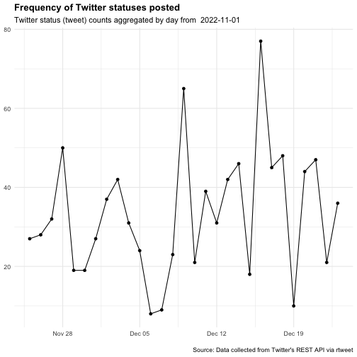

Pipelines For Data Analysis In R, part 2
========================================================
author: 曾意儒 Yi-Ju Tseng
autosize: true
font-family: 'Microsoft JhengHei'
navigation: slide

資料分析步驟
========================================================
- **資料匯入** 
- **資料清洗處理**並轉換為Tidy data
- 資料分析
- 資料呈現與視覺化

資料匯入
====================================
- 從檔案匯入
- 從網路匯入
- 從Twitter匯入
- 從Google Sheet匯入
- 資料匯出

從檔案匯入
====================================
type:section
- Import Dataset功能 (RStudio)
- R物件 .rds
- R程式 .R
- 純文字資料 (無分隔)
- 其他格式

Import Dataset功能 (RStudio)
====================================
選取RStudio四分割視窗右上角的Environment標籤，選擇**Import Dataset**


Import Dataset功能 (RStudio)
====================================
- 選取`From Text (readr)`
- 點選`Browse`按鈕開啟檔案選取器


Import Dataset功能 (RStudio)
====================================
- 利用下方`Import Options`的選項微調參數
    - `Delimiter`分隔符號
    - `First Row as Names`首列是否為欄位名稱
    


Import Dataset功能 (RStudio)
====================================
type:alert
incremental:true

- 操作[範例檔案](https://raw.githubusercontent.com/CGUIM-BigDataAnalysis/BigDataCGUIM/master/EMBA_BigData/f_lvr_land_a.csv)
- 若匯入的檔案為**tab分隔文字檔**? 該如何調整參數？


R物件 .rds
====================================
type:sub-section
如果在R程式內處理完資料後，必須儲存一份以供後續分析，使用R物件儲存是最佳的方式

- 檔案小
- 讀取快速
- 推薦使用`readRDS()`函數讀取RDS檔案
- [A better way of saving and loading objects in R](http://www.fromthebottomoftheheap.net/2012/04/01/saving-and-loading-r-objects/)

```r
dataset <- readRDS("檔案路徑與名稱")
```

R程式 .R
====================================
type:sub-section
- `source`函數
- 讀R的Obejct or script, **執行**
- **實際操作範例**
    - 有一份example.R檔在工作環境中
    - 一次執行檔案內所有R指令

```r
source("example.R") 
```

純文字資料 (無分隔)
====================================
type:sub-section
`readLines`, 逐行讀取文字資料

從網路匯入
====================================
type:section

- Open Data
- XML 可延伸標記式語言
- 網頁爬蟲 Webscraping
- API (Application programming interfaces)
- JSON格式檔案

Open Data 開放資料
====================================
type:sub-section
- 2011年推動開放政府與開放資料 ([維基百科](https://zh.wikipedia.org/wiki/%E9%96%8B%E6%94%BE%E8%B3%87%E6%96%99))
- 不受著作權、專利權，以及其他管理機制所限制，任何人都可以自由出版使用
- 常見的儲存方式為: 
    - `CSV`
    - `JSON`
    - `XML`
    
Open Data 開放資料常見平台
====================================
- [政府資料開放平台](https://data.gov.tw/)
- [Data Taipei](https://data.taipei/)
- [開放資料 x 開放桃園](https://data.tycg.gov.tw/)


XML 可延伸標記式語言
====================================
type:sub-section

- E**x**tensible **m**arkup **l**anguage
- 描述**結構化**資料的語言
- 處理XML檔案是網頁**Html**爬蟲的基礎
- Components
    - Markup 標記 - labels that give the text structure
    - Content 內文 - the actual text of the document
- [XML Wiki](https://zh.wikipedia.org/wiki/XML)

XML 可延伸標記式語言
====================================
Tags, elements and attributes

- Tags correspond to general labels
    - Start tags `<breakfast_menu>`, `<price>`
    - End tags `</breakfast_menu>`,`</price>`
    - Empty tags `<line-break />`
- Elements are specific examples of tags
    - `<name>Belgian Waffles</name>`
- Attributes are components of the label
    - `<book category="web">`
    
XML 可延伸標記式語言-讀取
====================================
- [空氣品質指標(AQI)](https://data.epa.gov.tw/api/v1/aqx_p_432?limit=1000&api_key=9be7b239-557b-4c10-9775-78cadfc555e9&format=xml)
- 安裝`xml2` package
- `read_xml()`函數將XML檔案匯入


```r
library(xml2)
AQIURL<-"https://data.epa.gov.tw/api/v2/aqx_p_432?api_key=e8dd42e6-9b8b-43f8-991e-b3dee723a52d&limit=1000&sort=ImportDate%20desc&format=XML"
AQIXML <- read_xml(AQIURL)
```

xpath?
====================================
- XML路徑語言（XML Path Language）
- 基於XML的樹狀結構，提供在資料結構樹中找尋節點的能力
- [維基百科](https://zh.wikipedia.org/wiki/XPath)
- [常見語法](http://tech-marsw.logdown.com/blog/2016/01/11/parsing-lxml-xpath-sheet)

XML 可延伸標記式語言-解析
====================================
使用`xml_find_all()`以及`xml_text()`函數取得指定標籤內的資料

```r
#取得所有"SiteName"標籤內的資料
SiteName_xml<-xml_find_all(AQIXML, ".//SITENAME")
SiteName<-xml_text(SiteName_xml)
SiteName[1:10]
```

```
 [1] "基隆" "汐止" "萬里" "新店" "土城" "板橋" "新莊" "菜寮" "林口" "淡水"
```

XML 可延伸標記式語言-解析
====================================
使用`xml_find_all()`以及`xml_text()`函數取得指定標籤內的資料

```r
#取得各監測站的經度longitude
longitude_xml<-xml_find_all(AQIXML, ".//LONGITUDE")
longitude<-xml_text(longitude_xml)
longitude[1:10]
```

```
 [1] "121.760056"   "121.6423"     "121.689881"   "121.537778"   "121.451861"  
 [6] "121.458667"   "121.4325"     "121.481028"   "121.36548982" "121.449239"  
```

XML檔案匯入練習
====================================
type:alert
incremental:true
- 載入[農產品交易行情](https://data.coa.gov.tw/Service/OpenData/FromM/FarmTransData.aspx?FOTT=Xml)
- 嘗試取得各筆交易的作物名稱與平均價
- 參考剛剛的AQI範例

```r
library(xml2)
AQIURL<-"https://data.epa.gov.tw/api/v2/aqx_p_432?api_key=e8dd42e6-9b8b-43f8-991e-b3dee723a52d&limit=1000&sort=ImportDate%20desc&format=XML"
AQIXML <- read_xml(AQIURL)
SiteName_xml<-xml_find_all(AQIXML, ".//SITENAME")
SiteName<-xml_text(SiteName_xml)
SiteName[1:10]
```


API
====================================
type:sub-section
- 應用程式介面
- **A**pplication **P**rogramming **I**nterfaces
- 為了讓第三方的開發者可以額外開發應用程式來強化他們的產品，推出可以與系統溝通的介面
- 有API輔助可將資料擷取過程自動化
    -  以下載Open Data為例，若檔案更新頻繁，使用手動下載相當耗時
- [維基百科](https://zh.wikipedia.org/zh-tw/%E5%BA%94%E7%94%A8%E7%A8%8B%E5%BA%8F%E6%8E%A5%E5%8F%A3)

API - Open Data
====================================
- [桃園公共自行車即時服務資料](http://data.tycg.gov.tw/opendata/datalist/datasetMeta?oid=5ca2bfc7-9ace-4719-88ae-4034b9a5a55c)資料
- 每日更新
- 不可能每日手動下載
- 提供透過**API**下載的服務
- 透過API下載的資料格式: **JSON格式**

***

- [桃園公共自行車即時服務資料API資訊](http://data.tycg.gov.tw/opendata/datalist/datasetMeta/outboundDesc?id=5ca2bfc7-9ace-4719-88ae-4034b9a5a55c&rid=a1b4714b-3b75-4ff8-a8f2-cc377e4eaa0f)
    - **資料集ID**: 紀錄資料的基本參數，如包含欄位、更新頻率等
    - **資料RID**: 資料集
    - 擷取範例


JSON格式檔案
====================================
type:sub-section

- JSON (**J**ava**s**cript **O**bject **N**otation)
- 輕量級的資料交換語言
- From **a**pplication **p**rogramming **i**nterfaces (APIs)
- JavaScript、Java、Node.js應用
- 一些NoSQL資料庫用JSON儲存資料：**MongoDB**
- [Wiki](http://en.wikipedia.org/wiki/JSON)


JSON檔案匯入
====================================
- `jsonlite` package (套件使用前必須安裝)
- `fromJSON()`函數載入JSON資料
- 如果API網址為**https**，則需使用 `httr` package
    - 使用`GET()`函數處理資料擷取網址
- API網址參考[桃園公共自行車即時服務資料API資訊](http://data.tycg.gov.tw/opendata/datalist/datasetMeta/outboundDesc?id=5ca2bfc7-9ace-4719-88ae-4034b9a5a55c&rid=a1b4714b-3b75-4ff8-a8f2-cc377e4eaa0f)

```r
library(jsonlite)
APIData<-fromJSON("http://data.tycg.gov.tw/api/v1/rest/datastore/a1b4714b-3b75-4ff8-a8f2-cc377e4eaa0f?format=json")
```

JSON檔案匯入
====================================
- 轉存為`列表list`的型態
- 兩個子元素(success, result)
- result中records子元素的類別為資料框data.frame

```r
str(APIData)
```

```
List of 2
 $ success: logi TRUE
 $ result :List of 8
  ..$ include_total : logi TRUE
  ..$ resource_id   : chr "a1b4714b-3b75-4ff8-a8f2-cc377e4eaa0f"
  ..$ fields        :'data.frame':	15 obs. of  2 variables:
  .. ..$ type: chr [1:15] "int" "text" "text" "text" ...
  .. ..$ id  : chr [1:15] "_id" "sno" "sna" "tot" ...
  ..$ records_format: chr "objects"
  ..$ records       :'data.frame':	100 obs. of  15 variables:
  .. ..$ _id    : int [1:100] 1 2 3 4 5 6 7 8 9 10 ...
  .. ..$ sno    : chr [1:100] "2001" "2002" "2003" "2004" ...
  .. ..$ sna    : chr [1:100] "中央大學圖書館" "中壢高中" "中正公園(中美路)" "中壢火車站(前站)" ...
  .. ..$ tot    : chr [1:100] "60" "52" "54" "94" ...
  .. ..$ sbi    : chr [1:100] "36" "30" "11" "33" ...
  .. ..$ sarea  : chr [1:100] "中壢區" "中壢區" "中壢區" "中壢區" ...
  .. ..$ mday   : chr [1:100] "20221209114226" "20221209114242" "20221209114250" "20221209114224" ...
  .. ..$ lat    : chr [1:100] "24.968128" "24.960815" "24.959113" "24.954042" ...
  .. ..$ lng    : chr [1:100] "121.194666" "121.212038" "121.224805" "121.22644" ...
  .. ..$ ar     : chr [1:100] "中大路300號(中央大學校內圖書館前)" "中央西路二段215號對面人行道" "中美路101-113號對面人行道" "中和路109號空地" ...
  .. ..$ sareaen: chr [1:100] "Zhongli Dist." "Zhongli Dist." "Zhongli Dist." "Zhongli Dist." ...
  .. ..$ snaen  : chr [1:100] "National Central University Library" "Jhungli Senior High School" "Zhongzheng Park (Zhongmei Rd.)" "TRA Zhongli Station (Front)" ...
  .. ..$ aren   : chr [1:100] "No.300, Zhongda Rd." "No.215, Sec. 2, Zhongyang W. Rd. (opposite)" "No.101 to No.113, Zhongmei Rd. (opposite)" "No. 109, Zhonghe Rd." ...
  .. ..$ bemp   : chr [1:100] "23" "22" "43" "58" ...
  .. ..$ act    : chr [1:100] "1" "1" "1" "1" ...
  ..$ offset        : int 0
  ..$ total         : int 400
  ..$ limit         : int 100
```

JSON檔案解析
====================================
- 使用`$`符號截取元素與子元素

```r
head(APIData$result$records)
```

| _id|sno  |sna              |tot |sbi |sarea  |mday           |lat       |lng        |
|---:|:----|:----------------|:---|:---|:------|:--------------|:---------|:----------|
|   1|2001 |中央大學圖書館   |60  |36  |中壢區 |20221209114226 |24.968128 |121.194666 |
|   2|2002 |中壢高中         |52  |30  |中壢區 |20221209114242 |24.960815 |121.212038 |
|   3|2003 |中正公園(中美路) |54  |11  |中壢區 |20221209114250 |24.959113 |121.224805 |
|   4|2004 |中壢火車站(前站) |94  |33  |中壢區 |20221209114224 |24.954042 |121.22644  |
|   5|2005 |中原大學         |82  |45  |中壢區 |20221209114218 |24.957943 |121.240201 |
|   6|2006 |銀河廣場         |58  |13  |中壢區 |20221209114239 |24.961716 |121.224241 |
|   7|2007 |中壢區公所       |40  |14  |中壢區 |20221209114224 |24.965697 |121.224696 |
|   8|2008 |光明公園         |96  |64  |中壢區 |20221209114229 |24.962812 |121.217385 |

JSON檔案解析
====================================
分析各項**地區**車站數

```r
table(APIData$result$records$sarea)
```

|Var1   | Freq|
|:------|----:|
|中壢區 |   35|
|八德區 |    5|
|大園區 |    2|
|大溪區 |    2|
|平鎮區 |    7|
|桃園區 |   32|
|蘆竹區 |    7|
|龜山區 |   10|
分析可知中壢區車站較多


JSON檔案匯入練習
====================================
type:alert
incremental:true

- 練習用資料：[桃園市路外停車資訊](https://data.tycg.gov.tw/opendata/datalist/datasetMeta/download?id=f4cc0b12-86ac-40f9-8745-885bddc18f79&rid=0daad6e6-0632-44f5-bd25-5e1de1e9146f)
- 使用檔案匯入**範例**，將資料匯入R中
    - 提示：**fromJSON**
- 使用str()函數觀察匯入的資料
- 請問有幾筆觀察值？幾個欄位？


網頁爬蟲 Webscraping
====================================
type:sub-section

- 不是每個網站都提供API
- 人工複製貼上?!
- 程式化的方式擷取網頁資料: **網頁爬蟲（Webscraping）**（[Webscraping Wiki](http://en.wikipedia.org/wiki/Web_scraping)）
- 可能耗費很多網頁流量和資源 －很可能被鎖IP
- 在R的處理辦法
    - 當作XML檔案處理分析
    - 使用`rvest` package輔助

網頁爬蟲 Webscraping-rvest
====================================

載入[rvest](https://github.com/hadley/rvest)套件後，經由以下步驟進行網站解析：

- 使用`read_html(“欲擷取的網站網址”)`函數讀取網頁
- 使用`html_nodes()`函數擷取所需內容 (條件為CSS或xpath標籤)
- 使用`html_text()`函數處理/清洗擷取內容，留下需要的資料
- 使用`html_attr()`函數擷取資料參數（如連結url）

網頁爬蟲 Webscraping-rvest
====================================

```r
library(rvest) ##載入
Repoterurl<-"https://www.twreporter.org/topics"
Repoterhtml<-read_html(Repoterurl)
news_title <- Repoterhtml %>% 
    html_nodes(".eIzpqT") %>% html_text()
news_title
```

```
[1] "那些縫補中的家庭，與他們的孩子──台灣兒少安置現況與未竟之事"
[2] "1978，請回答──亡國感下台灣主體藝文的追尋與迴聲"            
[3] "夢想、政治、金權──世界盃的追求"                            
[4] "地方政治的提升與倒退？"                                    
[5] "金馬59 | 凝視傷疤：幽暗之眼與一瞬之光"                     
```


網頁爬蟲 Webscraping-rvest
====================================
- 擷取條件的撰寫會因網頁語法不同而有差異
- 使用**Google Chrome開發工具**輔助觀察擷取資料的條件
    - 或使用**SelectorGadget**輔助
    - 或使用**xpath-helper**輔助xpath標籤的擷取
- 觀察需要擷取的資料所在HTML片段
    - css class為`.eIzpqT`


盤中奈米股資料爬取 -1
====================================

[零股資料](https://fubon-ebrokerdj.fbs.com.tw/z/ze/zeg/zega_EBTW50E_I.djhtm)


```r
library(rvest) 
NanoStockUrl<-"https://fubon-ebrokerdj.fbs.com.tw/z/ze/zeg/zega_EBTW50E_I.djhtm"
NanoStockContent<-read_html(NanoStockUrl)
NanoStockName<-
  NanoStockContent %>% html_nodes("#oAddCheckbox") %>% html_text()
NanoStockPrice<-
  NanoStockContent %>% html_nodes(".t3n1")%>% html_text()

head(NanoStockName)
```

```
[1] "\r\n\r\n<!--\r\n\tGenLink2stk('AS1101','台泥');\r\n//-->\r\n"  
[2] "\r\n\r\n<!--\r\n\tGenLink2stk('AS1216','統一');\r\n//-->\r\n"  
[3] "\r\n\r\n<!--\r\n\tGenLink2stk('AS1301','台塑');\r\n//-->\r\n"  
[4] "\r\n\r\n<!--\r\n\tGenLink2stk('AS1303','南亞');\r\n//-->\r\n"  
[5] "\r\n\r\n<!--\r\n\tGenLink2stk('AS1326','台化');\r\n//-->\r\n"  
[6] "\r\n\r\n<!--\r\n\tGenLink2stk('AS1402','遠東新');\r\n//-->\r\n"
```

```r
head(NanoStockPrice)
```

```
[1] "34.25"     "157,526"   "231"       "34.25"     "12,330"    "5,413,777"
```

盤中奈米股資料爬取 -2
====================================

```r
NanoStockPriceTable<-
  matrix(NanoStockPrice,ncol=6, byrow=TRUE)
NanoStockNameClean<-gsub('\\r|<|!|\\n|\\t|GenLink2stk|;|/|-|>',
                         '',
                         NanoStockName)
NanoStockData <- 
    data.frame(name = NanoStockNameClean,
               NanoStockPriceTable)
```

盤中奈米股資料爬取 -3
====================================

```r
NanoStockData
```

|name                    |X1       |X2        |X3  |X4       |X5     |X6          |
|:-----------------------|:--------|:---------|:---|:--------|:------|:-----------|
|('AS1101','台泥')       |34.25    |157,526   |231 |34.25    |12,330 |5,413,777   |
|('AS1216','統一')       |65.80    |8,118     |133 |65.80    |2,840  |533,696     |
|('AS1301','台塑')       |87.00    |45,726    |178 |87.00    |3,769  |3,943,609   |
|('AS1303','南亞')       |70.80    |26,749    |187 |70.80    |5,410  |1,893,381   |
|('AS1326','台化')       |69.80    |14,716    |142 |69.90    |1,872  |1,026,298   |
|('AS1402','遠東新')     |31.75    |24,361    |162 |31.80    |2,571  |772,114     |
|('AS1590','亞德客KY')   |915.00   |1,065     |32  |911.00   |5      |966,589     |
|('AS2002','中鋼')       |30.65    |103,267   |239 |30.65    |14,347 |3,147,799   |
|('AS2207','和泰車')     |596.00   |2,307     |84  |596.00   |56     |1,358,852   |
|('AS2303','聯電')       |42.00    |126,587   |237 |42.00    |8,570  |5,319,658   |
|('AS2308','台達電')     |283.00   |79,023    |223 |283.50   |2,128  |22,239,664  |
|('AS2317','鴻海')       |101.00   |94,100    |256 |101.00   |14,369 |9,487,422   |
|('AS2327','國巨')       |461.50   |24,883    |171 |460.00   |4,182  |11,420,178  |
|('AS2330','台積電')     |455.50   |1,796,740 |261 |457.00   |45,413 |820,558,419 |
|('AS2357','華碩')       |273.00   |13,648    |174 |272.00   |1,476  |3,712,197   |
|('AS2379','瑞昱')       |298.00   |9,401     |136 |292.00   |100    |2,723,866   |
|('AS2382','廣達')       |71.90    |16,227    |182 |71.70    |1,414  |1,155,701   |
|('AS2395','研華')       |334.50   |1,632     |84  |332.00   |732    |540,577     |
|('AS2408','南亞科')     |54.60    |23,674    |147 |51.30    |1,138  |1,211,868   |
|('AS2412','中華電')     |113.00   |23,032    |171 |113.00   |4,656  |2,588,144   |
|('AS2454','聯發科')     |662.00   |39,663    |244 |662.00   |2,097  |26,031,789  |
|('AS2603','長榮')       |167.00   |156,224   |250 |167.50   |33,409 |26,058,553  |
|('AS2609','陽明')       |67.50    |116,508   |230 |67.60    |6,877  |7,832,024   |
|('AS2615','萬海')       |86.10    |127,870   |243 |86.20    |16,726 |10,894,336  |
|('AS2801','彰銀')       |17.30    |7,795     |89  |17.25    |3,873  |134,692     |
|('AS2880','華南金')     |22.60    |41,334    |172 |22.60    |6,766  |935,452     |
|('AS2881','富邦金')     |56.90    |51,517    |204 |56.80    |11,692 |2,922,216   |
|('AS2882','國泰金')     |41.15    |130,329   |230 |41.15    |27,527 |5,351,083   |
|('AS2883','開發金')     |12.80    |47,260    |191 |12.75    |12,429 |603,616     |
|('AS2884','玉山金')     |24.25    |117,939   |239 |24.25    |13,933 |2,852,065   |
|('AS2885','元大金')     |21.90    |103,102   |193 |21.90    |9,897  |2,251,812   |
|('AS2886','兆豐金')     |30.70    |125,985   |250 |30.70    |7,613  |3,856,913   |
|('AS2887','台新金')     |15.20    |59,500    |207 |15.20    |12,632 |901,717     |
|('AS2890','永豐金')     |16.80    |173,027   |233 |16.75    |12,380 |2,907,750   |
|('AS2891','中信金')     |22.10    |81,832    |225 |22.00    |6,516  |1,795,586   |
|('AS2892','第一金')     |26.30    |37,840    |207 |26.35    |8,547  |995,774     |
|('AS2912','統一超')     |270.00   |10,062    |158 |270.00   |1,524  |2,705,095   |
|('AS3008','大立光')     |2,140.00 |9,418     |196 |2,140.00 |288    |20,087,415  |
|('AS3034','聯詠')       |302.00   |17,499    |179 |302.00   |1,910  |5,255,486   |
|('AS3037','欣興')       |125.00   |105,892   |233 |125.00   |9,429  |13,090,096  |
|('AS3045','台灣大')     |94.70    |6,304     |106 |94.80    |1,894  |595,134     |
|('AS3711','日月光投控') |94.50    |65,331    |217 |94.20    |2,310  |6,143,494   |
|('AS4904','遠傳')       |66.80    |14,827    |141 |65.80    |1,732  |976,718     |
|('AS5871','中租KY')     |216.00   |31,371    |173 |216.00   |2,553  |6,771,626   |
|('AS5876','上海商銀')   |44.35    |18,314    |122 |44.35    |3,521  |808,507     |
|('AS5880','合庫金')     |26.05    |57,646    |217 |26.15    |6,589  |1,501,704   |
|('AS6415','矽力*KY')    |450.00   |5,878     |118 |442.00   |1,092  |2,596,635   |
|('AS6505','台塑化')     |82.80    |8,888     |117 |80.10    |1,167  |712,809     |
|('AS8046','南電')       |244.00   |30,752    |198 |242.00   |3,294  |7,420,091   |
|('AS9910','豐泰')       |208.00   |10,896    |136 |207.50   |345    |2,268,749   |

    
爬蟲練習
====================================
type:alert

- [Ptt Tech_Job 版](https://www.ptt.cc/bbs/Tech_Job/index.html)
- 試著爬出所有**標題**
- 爬出的第三個標題是？


網頁爬蟲 再想想？
====================================
incremental:true

- 其實... 很多資料有其他存取方式，像API
    - https://www.dcard.tw/_api/forums/cgu/posts
    - https://www.dcard.tw/_api/posts/225917717
    - https://www.dcard.tw/_api/posts/225917717/comments
- 隱私問題 （OkCupid事件）
    - [70,000 OkCupid Users Just Had Their Data Published](https://motherboard.vice.com/en_us/article/70000-okcupid-users-just-had-their-data-published)

進階爬蟲
====================================
- CSS Selector 語法介紹 [參考資料](https://www.w3schools.com/cssref/css_selectors.asp)
    - **.**xxx：select elements with class="xxx"
    - **#**xxx：select elements with id="xxx"
    - **[**yyy**]**：select elements with attribute yyy
    - **[**yyy=zzz**]**：select elements with attribute yyy="zzz"
    
- 瀑布式網頁爬蟲
    - 觀察Google Chrome 開發者工具，在Network內找到api呼叫方式
    - 搭配使用RSelenium 模擬瀏覽狀態 [DCard實作R Code](https://github.com/CGUIM-BigDataAnalysis/BigDataCGUIM/blob/master/105/RSelenium_rvest.md)


其他爬蟲相關參考資源
====================================
- [網路爬蟲實作 - 用 r 語言打造自己的爬蟲程式](https://www.slideshare.net/secret/mdfHLPgvIW1kPR)
- [rvest GitHub](https://github.com/tidyverse/rvest)
- R Bloggers 有很多[爬蟲範例](http://www.r-bloggers.com/?s=Web+Scraping)（英文）
- [Ptt爬蟲實作](http://bryannotes.blogspot.tw/2014/08/r-ptt-wantedsocial-network-analysis.html)
- [大數學堂 網頁爬蟲課程](http://www.largitdata.com/course_list/1)


從Facebook匯入
====================================
type:section
- Graph API in R
- Rfacebook package

Graph API in R
====================================
type:sub-section

- 在2018年的風波後，Graph API若要用在爬取公開粉專，須經過FB審核
- [Graph API](https://developers.facebook.com/docs/graph-api?locale=zh_TW)
    - 根據篩選條件，回傳JSON格式的資料
- [Graph API Explorer](https://developers.facebook.com/tools/explorer/)
    - 測試資料撈取方法和結果
- 必須要取得自己的**access token** (存取權杖)
    - 可在[Graph API Explorer](https://developers.facebook.com/tools/explorer/)視窗右上角的**Get Token**按鈕取得
    - [官方文件](https://developers.facebook.com/docs/facebook-login/access-tokens/?locale=zh_TW)


Rfacebook package
====================================
type:sub-section
在2018年的風波後，Graph API若要用在爬取公開粉專，須經過FB審核，因此本課程目前無法示範粉絲專頁爬取

使用 Rfacebook 取得 `tsaiingwen` 粉絲頁的資料

```r
library(Rfacebook) #初次使用須先安裝
token<-"your token" #將token複製到此處
getPage("tsaiingwen", token,n = 5)
```
若經過審核，可得下列結果

```
4 posts       from_id           from_name
1 46251501064 蔡英文 Tsai Ing-wen
2 46251501064 蔡英文 Tsai Ing-wen
3 46251501064 蔡英文 Tsai Ing-wen
4 46251501064 蔡英文 Tsai Ing-wen
```

從Twitter匯入
====================================
type:section
- Twitter API
- rtweet package

Twitter API
====================================
- https://developer.twitter.com/en/apps
- 需有Twitter帳號並通過開發者審核

rtweet package
====================================

```r
## install rtweet from CRAN
install.packages("rtweet")
## load rtweet package
library(rtweet)
```

rtweet package - token 設定
====================================

```r
library(rtweet)
create_token(
  app = "teach0309",
  consumer_key = "Wbba6ysyPKGstGAqohmtyWZOE",
  consumer_secret = "GJweDzVvXGrbjz26bHTr3d6dFI7q9gFCH98f3Ct2yk3APPWigc",
  access_token = "216362944-AxxvSiPBR7nBScfBks7thajSovUwFG6v67aNR3WP",
  access_secret = "pF0OldOjiJxaBbPlQhx7V3VkA6MIgdzHHofar1DM0pX0G")
```

rtweet package - 搜尋hashtag
====================================

```r
## search for 3000 tweets using the Taiwan hashtag
rt <- search_tweets(
  "#Taiwan", n = 3000, include_rts = FALSE
)
head(rt)
```

|created_at          |           id|id_str              |full_text                                                                                                                                                                                                                                                                                      |
|:-------------------|------------:|:-------------------|:----------------------------------------------------------------------------------------------------------------------------------------------------------------------------------------------------------------------------------------------------------------------------------------------|
|2022-12-23 18:33:07 | 1.606236e+18|1606236454769725441 |Grateful to the members of #Taiwan’s armed forces for all they do to defend our nation. This Christmas, we reaffirm our commitment to providing them with the living &amp; training environment they need to be the best they can be. https://t.co/xF59AmbQHY                                  |
|2022-12-23 05:47:14 | 1.606044e+18|1606043712873566208 |While much of the attention of the public, #NATSEC analysts and journalists has been rightly on the visit of @ZelenskyyUa to Washington DC, we should not forget the Chinese aggression around #Taiwan. This is a good daily wrap up from @MoNDefense https://t.co/zI3Vev5W2a                  |
|2022-12-23 11:35:34 | 1.606131e+18|1606131371247751169 |Congrats to #Taiwanese photographer Wang Chen-che (王呈哲), who won nine gold medals at the New York Photography Awards for three of his photographic works! The gold-winning pieces are images of temples and religious festivals in #Taiwan. https://t.co/DZj9CuSgfL https://t.co/KRtlMd5ZMH |
|2022-12-24 11:30:06 | 1.606492e+18|1606492385353269248 |#Taiwan #AQI #Yunlin #Mailiao 雲林麥寮, 良好, 主要污染: 無, 空氣品質指標: 50, PM2.5: 15, PM10: 74, 更新時間: 2022/12/24 11:00:00                                                                                                                                                               |
|2022-12-24 11:30:06 | 1.606492e+18|1606492384636063745 |#Taiwan #AQI #Kaohsiung #Xiaogang 高雄小港, 普通, 主要污染: 細懸浮微粒, 空氣品質指標: 88, PM2.5: 28, PM10: 52, 更新時間: 2022/12/24 11:00:00                                                                                                                                                   |
|2022-12-24 11:30:06 | 1.606492e+18|1606492383935627265 |#Taiwan #AQI #Taichung #Xitun 臺中西屯, 良好, 主要污染: 無, 空氣品質指標: 33, PM2.5: 9, PM10: 31, 更新時間: 2022/12/24 11:00:00                                                                                                                                                                |

rtweet package - 搜尋hashtag
====================================


rtweet package - 取得趨勢
====================================

```r
sf <- get_trends("USA")
head(sf)
```

|trend       |url                                     |promoted_content |query       |
|:-----------|:---------------------------------------|:----------------|:-----------|
|Christmas   |http://twitter.com/search?q=Christmas   |NA               |Christmas   |
|Weihnachten |http://twitter.com/search?q=Weihnachten |NA               |Weihnachten |
|Noël        |http://twitter.com/search?q=No%C3%ABl   |NA               |No%C3%ABl   |
|Festtage    |http://twitter.com/search?q=Festtage    |NA               |Festtage    |

rtweet package - 取得timeline
====================================

```r
tmls_Bezos <- get_timelines("JeffBezos", n = 1000)
tmls_Musk <- get_timelines( "elonmusk", n = 1000)
head(tmls_Bezos)
head(tmls_Musk)
```

|full_text                                                                                                                                                                                                                                                                                                       |source                                                                             |
|:---------------------------------------------------------------------------------------------------------------------------------------------------------------------------------------------------------------------------------------------------------------------------------------------------------------|:----------------------------------------------------------------------------------|
|This year’s Bezos Day 1 Families Fund grants go to 40 incredible groups working to end homelessness in the U.S. In 5 years, we’ve given more than $500 million to 167 orgs – helping expand their support of families in need. Honored to support these groups. https://t.co/8fulJLNrkZ https://t.co/17dX56oApm |<a href="http://twitter.com/download/iphone" rel="nofollow">Twitter for iPhone</a> |
|RT @awscloud: .@Werner is pulling back the curtain on #Amazon history with the Distributed Computing Manifesto.

Read the 25-year-old inter…                                                                                                                                                                      |<a href="http://twitter.com/download/iphone" rel="nofollow">Twitter for iPhone</a> |
|We’ve just announced a new Courage and Civility award recipient —  @DollyParton, who leads with her heart, and will put this $100 million award to great use helping so many people. She joins prior awardees, @VanJones68 and @Chefjoseandres.  Congrats, Dolly! https://t.co/dzTuoGVp3G                       |<a href="http://twitter.com/download/iphone" rel="nofollow">Twitter for iPhone</a> |
|Yep, the probabilities in this economy tell you to batten down the hatches. https://t.co/SwldRdms5v                                                                                                                                                                                                             |<a href="http://twitter.com/download/iphone" rel="nofollow">Twitter for iPhone</a> |
|The Hutch is going to do incredible things with this.

https://t.co/m3BKYhKwr9                                                                                                                                                                                                                                    |<a href="http://twitter.com/download/iphone" rel="nofollow">Twitter for iPhone</a> |
|Invention. You can still improve even an axe! Damn. https://t.co/9vM9Nq3L6i                                                                                                                                                                                                                                     |<a href="http://twitter.com/download/iphone" rel="nofollow">Twitter for iPhone</a> |


|full_text                                                                                                                                                                                                                                         |source                                                                             |
|:-------------------------------------------------------------------------------------------------------------------------------------------------------------------------------------------------------------------------------------------------|:----------------------------------------------------------------------------------|
|@cyrusrezvanian @christine_rez Almost no one understands                                                                                                                                                                                          |<a href="http://twitter.com/download/iphone" rel="nofollow">Twitter for iPhone</a> |
|@tobi You can also now play all Steam games on the latest Model S/X cars                                                                                                                                                                          |<a href="http://twitter.com/download/iphone" rel="nofollow">Twitter for iPhone</a> |
|@BillFOXLA @FoxNews !!                                                                                                                                                                                                                            |<a href="http://twitter.com/download/iphone" rel="nofollow">Twitter for iPhone</a> |
|@PranavHegdeHere That and several major UI improvements coming in Jan                                                                                                                                                                             |<a href="http://twitter.com/download/iphone" rel="nofollow">Twitter for iPhone</a> |
|@CollinRugg To be clear, I am overall very much pro FBI. The agency does a great deal of important work protecting the public. 

That said, no organization is perfect and part of the FBI obviously overreached with respect to online censorship. |<a href="http://twitter.com/download/iphone" rel="nofollow">Twitter for iPhone</a> |
|@breeadail And engineering                                                                                                                                                                                                                        |<a href="http://twitter.com/download/iphone" rel="nofollow">Twitter for iPhone</a> |

rtweet package - 取得timeline
====================================



rtweet package - favorites
====================================

```r
## get user IDs of accounts favorited by Elon Musk
em_flw <- get_favorites("elonmusk", n = 100)
head(em_flw)
```

|text                                                                                                                                                                                                                                                                                              |created_at          |id_str              |
|:-------------------------------------------------------------------------------------------------------------------------------------------------------------------------------------------------------------------------------------------------------------------------------------------------|:-------------------|:-------------------|
|Code is a liability, not an asset. So goal of software engineer is delivering the maximum amount of desired functionality at the cost of the least amount of code complexity, even as desired functionality evolves over time.                                                                    |2022-12-24 11:03:42 |1606485739679932416 |
|We wish you a Merry Christmas 🎶
We wish you a Merry Christmas 🎶
We wish you a Merry Christmas 🎶
Aaand a happy new yeaaaar 😘 🎶 https://t.co/ZkZo1KeXG4                                                                                                                                           |2022-12-24 10:24:10 |1606475794335043585 |
|I would LOVE the ability to upload my YouTube catalogue to twitter &amp; display it in an easily searchable format for followers. YouTube have mastered video, but their algorithm is annoyingly mysterious &amp; fussy, and it punishes channels that don’t pick a lane &amp; stick to it. Lame. |2022-12-24 03:05:11 |1606365319743799307 |
|If they weren’t trying to sink the economy, what else would they be doing differently? https://t.co/9x42pK3Dve                                                                                                                                                                                    |2022-12-24 03:03:55 |1606365001739931648 |
|@elonmusk @RealDanODowd I'm very impressed with the latest FSD software.  I finally am getting my money's worth and then some.  Thanks out to the entire Tesla Team!!  Great job!@                                                                                                                |2022-12-24 02:22:09 |1606354490851872768 |
|These corporate media people are so fucking twisted they think Aaron Ruper -- a video dunce who watches TV all day and posts distorted clips to Twitter -- is a "journalist."

But they think Julian Assange and Matt Taibbi aren't journalists.

Tells you all you need to know.                     |2022-12-24 02:11:19 |1606351761253445632 |


rtweet package練習
====================================
type:alert
incremental:true
- 複製老師的Twitter access token
- 使用rtweet package取得**蔡英文 Tsai Ing-wen**(iingwen)的timeline，共50筆tweets
- 第一筆資料的retweet_count是多少?
- 第二筆資料的favorite_count是多少?

從Google sheet匯入
====================================
type:section

- googlesheets4 package


googlesheets4 package
====================================

```r
## install googlesheets4 from CRAN (already included in tidyverse)
install.packages("googlesheets4")
## load googlesheets4 package
library(googlesheets4)
```


googlesheets4 package
====================================
使用`read_sheet()`讀入[範例google sheet](https://docs.google.com/spreadsheets/d/13gnwAUXaxHATsZIGO3mPtdxLMxseE1oYNjgTV4tdFkk/edit#gid=0)

```r
read_sheet("https://docs.google.com/spreadsheets/d/13gnwAUXaxHATsZIGO3mPtdxLMxseE1oYNjgTV4tdFkk/edit#gid=0")
```

```
# A tibble: 14 × 7
    學號 作業一 ...3  ...4  ...5  心得一 心得二
   <dbl> <chr>  <lgl> <lgl> <lgl> <chr>  <chr> 
 1     1 O      NA    NA    NA    <NA>   <NA>  
 2     2 O      NA    NA    NA    O      <NA>  
 3     3 O      NA    NA    NA    O      O     
 4     4 O      NA    NA    NA    O      <NA>  
 5     5 O      NA    NA    NA    O      <NA>  
 6     6 O      NA    NA    NA    <NA>   <NA>  
 7     7 O      NA    NA    NA    <NA>   <NA>  
 8     8 O      NA    NA    NA    <NA>   <NA>  
 9     9 O      NA    NA    NA    O      <NA>  
10    10 O      NA    NA    NA    O      <NA>  
11    11 O      NA    NA    NA    O      <NA>  
12    12 O      NA    NA    NA    <NA>   <NA>  
13    13 O      NA    NA    NA    <NA>   <NA>  
14    14 O      NA    NA    NA    <NA>   <NA>  
```

需要開啟google 授權
====================================


googlesheets4 package
====================================
使用`read_sheet()`讀入[範例google sheet](https://docs.google.com/spreadsheets/d/13gnwAUXaxHATsZIGO3mPtdxLMxseE1oYNjgTV4tdFkk/edit#gid=0)

```r
read_sheet("https://docs.google.com/spreadsheets/d/13gnwAUXaxHATsZIGO3mPtdxLMxseE1oYNjgTV4tdFkk/edit#gid=0")
```

| 學號|作業一 |...3 |...4 |...5 |心得一 |心得二 |
|----:|:------|:----|:----|:----|:------|:------|
|    1|O      |NA   |NA   |NA   |NA     |NA     |
|    2|O      |NA   |NA   |NA   |O      |NA     |
|    3|O      |NA   |NA   |NA   |O      |O      |
|    4|O      |NA   |NA   |NA   |O      |NA     |
|    5|O      |NA   |NA   |NA   |O      |NA     |
|    6|O      |NA   |NA   |NA   |NA     |NA     |
|    7|O      |NA   |NA   |NA   |NA     |NA     |
|    8|O      |NA   |NA   |NA   |NA     |NA     |
|    9|O      |NA   |NA   |NA   |O      |NA     |
|   10|O      |NA   |NA   |NA   |O      |NA     |
|   11|O      |NA   |NA   |NA   |O      |NA     |
|   12|O      |NA   |NA   |NA   |NA     |NA     |
|   13|O      |NA   |NA   |NA   |NA     |NA     |
|   14|O      |NA   |NA   |NA   |NA     |NA     |

資料匯出
====================================
type:section
- 文字檔 .txt
- CSV檔 .csv
- R物件 .rds


文字檔 .txt write.table()
====================================
type:sub-section


```r
write.table(iris,file="iris.txt",sep=",",
            row.names = F,col.names = T)
```
- 要匯出的資料
- `file` 檔案名稱
- `append` T/F T:在檔案後加字，F:直接覆蓋檔案 (預設F)
- `quote` 是否需要用雙引號將字串包起 (預設T)
- `sep` 分隔符號 (預設空白)
- `row.names` T/F 是否需要輸出row names
- `col.names` T/F 是否需要輸出column names
- `fileEncoding` 編碼設定


CSV檔 .csv
====================================
type:sub-section

與`write.table()`類似，使用`write.csv()`函數寫入檔案

```r
write.csv(iris,file="iris.csv",row.names = F)
```

R物件 .rds
====================================
type:sub-section

若是要在R的環境繼續使用，建議匯出成R物件檔案(.rds)

```r
saveRDS(iris,"iris.rds")
```


資料清洗與處理
====================================
- Tidy Data
- 資料型別轉換處理
- 文字字串處理
- 子集Subset
- 排序
- 資料組合
- 長表轉寬表
- 遺漏值處理

Tidy Data
====================================
type:sub-section 

Each column is a variable. Each row is an observation.

- 一個欄位（Column）內只有一個數值，最好要有凡人看得懂的Column Name
- 不同的觀察值應該要在不同列（Row）
- 一張表裡面，有所有分析需要的資料
- 如果一定要多張表，中間一定要有index可以把表串起來
- One file, one table

資料型別轉換處理
====================================
type:sub-section 
包括**資料型別檢查**與**資料型別轉換**

資料型別:

- 數值 (numeric)
- 字串 (character)
- 布林變數 (logic)
- 日期 (Date)


資料型別檢查 - is.
====================================
使用`is.`函數檢查資料型別，回傳布林變數，若為**真**，回傳**TRUE**

- 是否為**數字** `is.numeric(變數名稱)`
- 是否為**文字** `is.character(變數名稱)`
- 是否為**布林變數** `is.logical(變數名稱)`


```r
num<-100
is.numeric(num)
```

```
[1] TRUE
```

```r
is.character(num)
```

```
[1] FALSE
```

資料型別檢查 - class()
====================================
使用`class(變數名稱)`函數，直接回傳**資料型別**

```r
class(num)
```

```
[1] "numeric"
```

```r
class(Sys.Date())
```

```
[1] "Date"
```


資料型別轉換 - as.
====================================

使用`as.`函數轉換型別

- 轉換為**數字** `as.numeric(變數名稱)`
- 轉換為**文字** `as.character(變數名稱)`
- 轉換為**布林變數** `as.logical(變數名稱)`


```r
cha<-"100"
as.numeric(cha)
```

```
[1] 100
```

資料型別轉換 - as.
====================================

若無法順利完成轉換，會回傳空值`NA`，並出現警告訊息

```r
as.numeric("abc")
```

```
[1] NA
```


資料型別轉換練習
====================================
type:alert
回想起奈米股盤中交易的資料．．．

```r
library(rvest) 
NanoStockUrl<-"https://fubon-ebrokerdj.fbs.com.tw/z/ze/zeg/zega_EBTW50E_I.djhtm"
NanoStockContent<-read_html(NanoStockUrl)
NanoStockName<-
  NanoStockContent %>% html_nodes("#oAddCheckbox") %>% 
    html_text()
NanoStockPrice<-
  NanoStockContent %>% html_nodes(".t3n1")%>% 
    html_text()
NanoStockPriceTable<-
  matrix(NanoStockPrice,ncol=6, byrow=TRUE)
NanoStockNameClean<-gsub('\\r|<|!|\\n|\\t|GenLink2stk|;|/|-|>',
                         '',
                         NanoStockName)
NanoStockData <- 
    data.frame(name = NanoStockNameClean,
               NanoStockPriceTable)
knitr::kable(NanoStockData) 
```


|name                    |X1       |X2        |X3  |X4       |X5     |X6          |
|:-----------------------|:--------|:---------|:---|:--------|:------|:-----------|
|('AS1101','台泥')       |34.25    |157,526   |231 |34.25    |12,330 |5,413,777   |
|('AS1216','統一')       |65.80    |8,118     |133 |65.80    |2,840  |533,696     |
|('AS1301','台塑')       |87.00    |45,726    |178 |87.00    |3,769  |3,943,609   |
|('AS1303','南亞')       |70.80    |26,749    |187 |70.80    |5,410  |1,893,381   |
|('AS1326','台化')       |69.80    |14,716    |142 |69.90    |1,872  |1,026,298   |
|('AS1402','遠東新')     |31.75    |24,361    |162 |31.80    |2,571  |772,114     |
|('AS1590','亞德客KY')   |915.00   |1,065     |32  |911.00   |5      |966,589     |
|('AS2002','中鋼')       |30.65    |103,267   |239 |30.65    |14,347 |3,147,799   |
|('AS2207','和泰車')     |596.00   |2,307     |84  |596.00   |56     |1,358,852   |
|('AS2303','聯電')       |42.00    |126,587   |237 |42.00    |8,570  |5,319,658   |
|('AS2308','台達電')     |283.00   |79,023    |223 |283.50   |2,128  |22,239,664  |
|('AS2317','鴻海')       |101.00   |94,100    |256 |101.00   |14,369 |9,487,422   |
|('AS2327','國巨')       |461.50   |24,883    |171 |460.00   |4,182  |11,420,178  |
|('AS2330','台積電')     |455.50   |1,796,740 |261 |457.00   |45,413 |820,558,419 |
|('AS2357','華碩')       |273.00   |13,648    |174 |272.00   |1,476  |3,712,197   |
|('AS2379','瑞昱')       |298.00   |9,401     |136 |292.00   |100    |2,723,866   |
|('AS2382','廣達')       |71.90    |16,227    |182 |71.70    |1,414  |1,155,701   |
|('AS2395','研華')       |334.50   |1,632     |84  |332.00   |732    |540,577     |
|('AS2408','南亞科')     |54.60    |23,674    |147 |51.30    |1,138  |1,211,868   |
|('AS2412','中華電')     |113.00   |23,032    |171 |113.00   |4,656  |2,588,144   |
|('AS2454','聯發科')     |662.00   |39,663    |244 |662.00   |2,097  |26,031,789  |
|('AS2603','長榮')       |167.00   |156,224   |250 |167.50   |33,409 |26,058,553  |
|('AS2609','陽明')       |67.50    |116,508   |230 |67.60    |6,877  |7,832,024   |
|('AS2615','萬海')       |86.10    |127,870   |243 |86.20    |16,726 |10,894,336  |
|('AS2801','彰銀')       |17.30    |7,795     |89  |17.25    |3,873  |134,692     |
|('AS2880','華南金')     |22.60    |41,334    |172 |22.60    |6,766  |935,452     |
|('AS2881','富邦金')     |56.90    |51,517    |204 |56.80    |11,692 |2,922,216   |
|('AS2882','國泰金')     |41.15    |130,329   |230 |41.15    |27,527 |5,351,083   |
|('AS2883','開發金')     |12.80    |47,260    |191 |12.75    |12,429 |603,616     |
|('AS2884','玉山金')     |24.25    |117,939   |239 |24.25    |13,933 |2,852,065   |
|('AS2885','元大金')     |21.90    |103,102   |193 |21.90    |9,897  |2,251,812   |
|('AS2886','兆豐金')     |30.70    |125,985   |250 |30.70    |7,613  |3,856,913   |
|('AS2887','台新金')     |15.20    |59,500    |207 |15.20    |12,632 |901,717     |
|('AS2890','永豐金')     |16.80    |173,027   |233 |16.75    |12,380 |2,907,750   |
|('AS2891','中信金')     |22.10    |81,832    |225 |22.00    |6,516  |1,795,586   |
|('AS2892','第一金')     |26.30    |37,840    |207 |26.35    |8,547  |995,774     |
|('AS2912','統一超')     |270.00   |10,062    |158 |270.00   |1,524  |2,705,095   |
|('AS3008','大立光')     |2,140.00 |9,418     |196 |2,140.00 |288    |20,087,415  |
|('AS3034','聯詠')       |302.00   |17,499    |179 |302.00   |1,910  |5,255,486   |
|('AS3037','欣興')       |125.00   |105,892   |233 |125.00   |9,429  |13,090,096  |
|('AS3045','台灣大')     |94.70    |6,304     |106 |94.80    |1,894  |595,134     |
|('AS3711','日月光投控') |94.50    |65,331    |217 |94.20    |2,310  |6,143,494   |
|('AS4904','遠傳')       |66.80    |14,827    |141 |65.80    |1,732  |976,718     |
|('AS5871','中租KY')     |216.00   |31,371    |173 |216.00   |2,553  |6,771,626   |
|('AS5876','上海商銀')   |44.35    |18,314    |122 |44.35    |3,521  |808,507     |
|('AS5880','合庫金')     |26.05    |57,646    |217 |26.15    |6,589  |1,501,704   |
|('AS6415','矽力*KY')    |450.00   |5,878     |118 |442.00   |1,092  |2,596,635   |
|('AS6505','台塑化')     |82.80    |8,888     |117 |80.10    |1,167  |712,809     |
|('AS8046','南電')       |244.00   |30,752    |198 |242.00   |3,294  |7,420,091   |
|('AS9910','豐泰')       |208.00   |10,896    |136 |207.50   |345    |2,268,749   |

資料型別轉換練習
====================================
type:alert
成交股數、總成交值都是字串型別 (chr)

```r
str(NanoStockData)
```

```
'data.frame':	50 obs. of  7 variables:
 $ name: chr  "('AS1101','台泥')" "('AS1216','統一')" "('AS1301','台塑')" "('AS1303','南亞')" ...
 $ X1  : chr  "34.25" "65.80" "87.00" "70.80" ...
 $ X2  : chr  "157,526" "8,118" "45,726" "26,749" ...
 $ X3  : chr  "231" "133" "178" "187" ...
 $ X4  : chr  "34.25" "65.80" "87.00" "70.80" ...
 $ X5  : chr  "12,330" "2,840" "3,769" "5,410" ...
 $ X6  : chr  "5,413,777" "533,696" "3,943,609" "1,893,381" ...
```
該如何將這兩個欄位轉成數字呢？

文字字串處理
====================================
type:sub-section 

- 基本處理
- 搜尋字串
- [Regular Expression 正規表示式 @ R](https://github.com/CGUIM-BigDataAnalysis/BigDataCGUIM/blob/master/105/RegularExpression.md)

基本處理
====================================

- 切割 `strsplit()` **Split**
- 子集 `substr()` **sub string**
- 大小寫轉換 `toupper()` `tolower()`
- 兩文字連接 `paste()` `paste0()`
- 文字取代 `gsub()` **substitute**
- 前後空白去除 `str_trim()` 需安裝`stringr` package **trim**

基本處理-切割
====================================
strsplit (欲切割的字串,用什麼符號切割)

```r
strsplit ("Hello World"," ")
```

```
[[1]]
[1] "Hello" "World"
```

基本處理-切割（多字元）|
====================================
strsplit (欲切割的字串,切割符號1|切割符號2|...)

```r
strsplit ("Hello World"," |o")
```

```
[[1]]
[1] "Hell" ""     "W"    "rld" 
```

基本處理-子集（切一小段）
====================================
substr(欲做子集的字串,開始位置,結束位置)

```r
substr("Hello World", start=2,stop=4)
```

```
[1] "ell"
```

基本處理-大小寫轉換
====================================

```r
toupper("Hello World")
```

```
[1] "HELLO WORLD"
```

```r
tolower("Hello World")
```

```
[1] "hello world"
```

基本處理-兩文字連接
====================================
paste(欲連接的字串1, 欲連接的字串2, 欲連接的字串3,.... sep=中間用什麼符號分隔)

```r
paste("Hello", "World")
```

```
[1] "Hello World"
```

```r
paste("Hello", "World", sep='')
```

```
[1] "HelloWorld"
```

```r
paste0("Hello", "World")
```

```
[1] "HelloWorld"
```

基本處理-文字取代
====================================
gsub(想要換掉的舊字串,想要換成的新字串,欲作取代的完整字串)

```r
gsub("o","0","Hello World")
```

```
[1] "Hell0 W0rld"
```

基本處理-文字取代（多字元）|
====================================
gsub(想要換掉的舊字串1|想要換掉的舊字串2|...,想要換成的新字串,欲作取代的完整字串)

```r
gsub("o|l","0","Hello World")
```

```
[1] "He000 W0r0d"
```

基本處理-前後空白去除
====================================
str_trim要使用前需要安裝與載入**stringr**套件

```r
library(stringr)
str_trim(" Hello World ")
```

```
[1] "Hello World"
```


搜尋字串
====================================
- 通常使用在**比對文字向量**
- **有分大小寫**
- 依照回傳值的型態不同，有兩種常用函數
    - 回傳符合條件之向量位置(index) `grep(搜尋條件,要搜尋的向量)`
    - 回傳每個向量是否符合條件(TRUE or FALSE) `grepl(搜尋條件,要搜尋的向量)`


```r
##在姓名文字向量中尋找A，回傳包含"A"之元素位置
grep("A",c("Alex","Tom","Amy","Joy","Emma")) 
```

```
[1] 1 3
```

搜尋字串 - grepl()
====================================

```r
##在姓名文字向量中尋找A，回傳各元素是否包含"A"
grepl("A",c("Alex","Tom","Amy","Joy","Emma")) 
```

```
[1]  TRUE FALSE  TRUE FALSE FALSE
```

```r
##在姓名文字向量中尋找a，回傳各元素是否包含"a"
grepl("a",c("Alex","Tom","Amy","Joy","Emma")) 
```

```
[1] FALSE FALSE FALSE FALSE  TRUE
```

搜尋字串 - grep()
====================================

```r
##在姓名文字向量中尋找A，回傳包含"A"的元素位置
grep("A",c("Alex","Tom","Amy","Joy","Emma")) 
```

```
[1] 1 3
```

```r
##在姓名文字向量中尋找a，回傳包含"a"的元素位置
grep("a",c("Alex","Tom","Amy","Joy","Emma")) 
```

```
[1] 5
```

搜尋字串 - grep()
====================================
type:alert
多字元？


子集Subset - 一維資料
====================================
type:sub-section 

之前有介紹使用`[ ]`取出單一或多個元素的方法

```r
letters ##R語言內建資料之一
```

```
 [1] "a" "b" "c" "d" "e" "f" "g" "h" "i" "j" "k" "l" "m" "n" "o" "p" "q" "r" "s"
[20] "t" "u" "v" "w" "x" "y" "z"
```

```r
letters[1] ##取出letters向量的第一個元素
```

```
[1] "a"
```

子集Subset - 一維資料
====================================

也可以用“負號”去掉不要的資料

```r
letters[c(1,3,5)] ##取出letters向量的第1,3,5個元素
```

```
[1] "a" "c" "e"
```

```r
letters[c(-1,-3,-5)] ##取出letters向量除了第1,3,5個元素之外的所有元素
```

```
 [1] "b" "d" "f" "g" "h" "i" "j" "k" "l" "m" "n" "o" "p" "q" "r" "s" "t" "u" "v"
[20] "w" "x" "y" "z"
```

子集Subset - 一維資料
====================================
若想要快速取得一向量的開頭與結尾元素，可使用`head()`和`tail()`函數

```r
head(letters,5) ##取出letters向量的前五個元素
```

```
[1] "a" "b" "c" "d" "e"
```

```r
tail(letters,3) ##取出letters向量的後三個元素
```

```
[1] "x" "y" "z"
```

子集Subset - 二維資料
====================================
type:sub-section 
- 可針對列(Row)和行(Column)做子集
- 使用`[ ]`，但因應二維資料的需求，以`,`分隔列與行的篩選條件
- 資料篩選原則為**前Row,後Column**，**前列,後行**
- 若不想篩選列，則在`,`前方保持**空白**即可。
- 篩選方式可輸入**位置(index)**、**欄位名稱**或輸入**布林變數(TRUE/FALSE)**
    - 輸入位置: `dataFrame[row index,column index]`
    - 輸入布林變數: `dataFrame[c(T,F,T),c(T,F,T)]`
    - 輸入欄位名稱: `dataFrame[row name,column name]`
- 最後常用的是dplyr中的`select()`和`filter()`功能

子集Subset - head()
====================================

若想要快速取得資料框的前幾列(Row)或後幾列，也可使用`head()`和`tail()`函數

```r
head(iris,5) ##取出iris資料框的前五列
```

| Sepal.Length| Sepal.Width| Petal.Length| Petal.Width|Species |
|------------:|-----------:|------------:|-----------:|:-------|
|          5.1|         3.5|          1.4|         0.2|setosa  |
|          4.9|         3.0|          1.4|         0.2|setosa  |
|          4.7|         3.2|          1.3|         0.2|setosa  |
|          4.6|         3.1|          1.5|         0.2|setosa  |
|          5.0|         3.6|          1.4|         0.2|setosa  |

子集Subset - tail()
====================================

若想要快速取得資料框的前幾列(Row)或後幾列，也可使用`head()`和`tail()`函數

```r
tail(iris,3) ##取出iris資料框的後三列
```

|    | Sepal.Length| Sepal.Width| Petal.Length| Petal.Width|Species   |
|:---|------------:|-----------:|------------:|-----------:|:---------|
|148 |          6.5|         3.0|          5.2|         2.0|virginica |
|149 |          6.2|         3.4|          5.4|         2.3|virginica |
|150 |          5.9|         3.0|          5.1|         1.8|virginica |


資料組合
====================================
type:sub-section

有時需要在資料框新增一列，或新增一行

- Row 列的組合 `rbind()`
- Column 行的組合 `cbind()`

`rbind()`和`cbind()`的參數可以是向量，也可以是資料框

資料組合 - rbind()
====================================

使用向量做資料整合範例:

```r
rbind(c(1,2,3), #第一列
      c(4,5,6)  #第二列
      ) 
```

```
     [,1] [,2] [,3]
[1,]    1    2    3
[2,]    4    5    6
```

資料組合 - rbind()
====================================

使用資料框與向量做資料整合範例:

```r
irisAdd<-rbind(iris, #資料框
      c(1,1,1,1,"versicolor")  #新增一列
      ) 
```

```r
tail(irisAdd,2)
```

|    |Sepal.Length |Sepal.Width |Petal.Length |Petal.Width |Species    |
|:---|:------------|:-----------|:------------|:-----------|:----------|
|150 |5.9          |3           |5.1          |1.8         |virginica  |
|151 |1            |1           |1            |1           |versicolor |

資料組合 - cbind()
====================================

使用向量做資料整合範例:

```r
cbind(c(1,2,3), #第一行
      c(4,5,6)  #第二行
      ) 
```

```
     [,1] [,2]
[1,]    1    4
[2,]    2    5
[3,]    3    6
```

資料組合 - cbind()
====================================

使用資料框與向量做資料整合範例:

```r
irisAdd<-cbind(iris, #資料框
      rep("Add",nrow(iris))  #新增一行
      ) 
```

```r
tail(irisAdd,1)
```

|    | Sepal.Length| Sepal.Width| Petal.Length| Petal.Width|Species   |rep("Add", nrow(iris)) |
|:---|------------:|-----------:|------------:|-----------:|:---------|:----------------------|
|150 |          5.9|           3|          5.1|         1.8|virginica |Add                    |

    
資料結合 (Join)
====================================

除了按照行列順序的組合外，更常有的情形是依照某個欄位的值作為結合依據，如：

- 用學號把以下兩個資料框結合成一個資料框
    - 學號與姓名資料框
    - 學號與宿舍床位資料框
- 用縣市名稱與年度將人口資料與醫療資源資料結合

資料結合 (Join)
====================================
原生的R環境可以用`merge()`函數將資料框結合，使用方法為`merge(資料框1,資料框2,by="結合依據欄位")`


```r
nameDF<-data.frame(ID=c(1,2,3,4,5),
                  Name=c("Amy","Bob","Chris","David","Emma"))
scoreDF<-data.frame(ID=c(1,2,4),
                  Score=c(60,90,50))
```

資料結合 (Join)
====================================

```r
nameDF
```

| ID|Name  |
|--:|:-----|
|  1|Amy   |
|  2|Bob   |
|  3|Chris |
|  4|David |
|  5|Emma  |
---

```r
scoreDF
```

| ID| Score|
|--:|-----:|
|  1|    60|
|  2|    90|
|  4|    50|

資料結合 (Join) 更有效率的做法
====================================

`dplyr`套件提供更有效率的資料結合方法，包括:

- inner_join()：保留有對應到的資料
- left_join()：保留左邊資料框的所有資料
- right_join()：保留右邊資料框的所有資料
- full_join()：保留所有資料
- semi_join()
- anti_join()

資料結合 - inner_join()
====================================
只保留兩張表都有的列
使用方法 `inner_join(x, y, by = )`


```r
library(dplyr)
inner_join(nameDF,scoreDF,by="ID")
```

```
  ID  Name Score
1  1   Amy    60
2  2   Bob    90
3  4 David    50
```

資料結合 - left_join()
====================================
保留左邊的表所有的列
使用方法 `left_join(x, y, by = )`


```r
library(dplyr)
left_join(nameDF,scoreDF,by="ID")
```

```
  ID  Name Score
1  1   Amy    60
2  2   Bob    90
3  3 Chris    NA
4  4 David    50
5  5  Emma    NA
```

資料結合 - right_join()
====================================
保留右邊的表所有的列
使用方法 `right_join(x, y, by = )`


```r
library(dplyr)
right_join(nameDF,scoreDF,by="ID")
```

```
  ID  Name Score
1  1   Amy    60
2  2   Bob    90
3  4 David    50
```

資料結合 - full_join()
====================================
保留所有的列
使用方法 `full_join(x, y, by = )`


```r
library(dplyr)
full_join(nameDF,scoreDF,by="ID")
```

```
  ID  Name Score
1  1   Amy    60
2  2   Bob    90
3  3 Chris    NA
4  4 David    50
5  5  Emma    NA
```

資料結合 - semi_join()
====================================
留下左邊的ID也有出現在右邊的表的列，右表資料不會輸出
使用方法 `semi_join(x, y, by = )`


```r
library(dplyr)
semi_join(nameDF,scoreDF,by="ID")
```

```
  ID  Name
1  1   Amy
2  2   Bob
3  4 David
```

資料結合 - anti_join()
====================================
留下左邊的ID沒有出現在右邊的表的列，右表資料不會輸出
使用方法 `anti_join(x, y, by = )`


```r
library(dplyr)
anti_join(nameDF,scoreDF,by="ID")
```

```
  ID  Name
1  3 Chris
2  5  Emma
```

資料結合練習
====================================
type:alert

- 下載[COVID-19案例數資料](https://raw.githubusercontent.com/CSSEGISandData/COVID-19/master/csse_covid_19_data/csse_covid_19_time_series/time_series_covid19_confirmed_global.csv)
- 下載[COVID-19死亡數資料](https://raw.githubusercontent.com/CSSEGISandData/COVID-19/master/csse_covid_19_data/csse_covid_19_time_series/time_series_covid19_deaths_global.csv)
- 分別讀入兩個csv檔
- 依照Province/State,Country/Region,Lat,Long四個欄位，將兩張表格結合，只留下有對應到的資料
- 請問結合後的資料有幾列？


長表與寬表
====================================
type:sub-section

- 在資料處理的過程中，常因各種需求，需要執行長寬表互換的動作
- `tidyr` package提供完整的轉換功能
    - 寬表轉長表 `pivot_longer(資料框/寬表,cols=需要轉換成長表的欄位)`
    - 長表轉寬表 `pivot_wider(資料框/長表,names_from=需要轉換成寬表的欄位)`
    
長表與寬表
====================================
原來的`airquality`資料框中，有Ozone, Solar.R, Wind, Temp, Month, Day等六個欄位 (Column)，屬於寬表

```r
head(airquality,3)
```

| Ozone| Solar.R| Wind| Temp| Month| Day|
|-----:|-------:|----:|----:|-----:|---:|
|    41|     190|  7.4|   67|     5|   1|
|    36|     118|  8.0|   72|     5|   2|
|    12|     149| 12.6|   74|     5|   3|

寬表轉長表 pivot_longer（）
====================================

- 保留Month和Day兩個欄位
- 消滅Ozone, Solar.R, Wind, Temp
- 將其他欄位的名稱整合至name欄位，數值整合至value欄位


```r
library(tidyr)
##欄位需要保留"Month","Day"
##欄位需要消滅"Ozone","Solar.R","Wind","Temp" -> 換轉換成"name"
airqualityLong<-
  pivot_longer(airquality,
               cols = c("Ozone","Solar.R","Wind","Temp")) 
```

```r
head(airqualityLong)
```

| Month| Day|name    | value|
|-----:|---:|:-------|-----:|
|     5|   1|Ozone   |  41.0|
|     5|   1|Solar.R | 190.0|
|     5|   1|Wind    |   7.4|
|     5|   1|Temp    |  67.0|
|     5|   2|Ozone   |  36.0|
|     5|   2|Solar.R | 118.0|

寬表轉長表 pivot_longer（）
====================================

- 保留Month和Day兩個欄位
- 消滅Ozone, Solar.R, Wind, Temp
- 將其他欄位的名稱整合至name欄位，數值整合至value欄位


```r
library(tidyr)
##欄位需要保留"Month","Day"
##欄位需要消滅"Ozone","Solar.R","Wind","Temp" -> 換轉換成"name"
airqualityLong<-
  pivot_longer(airquality,
               cols = c(-"Month",-"Day")) 
```

```r
head(airqualityLong)
```

| Month| Day|name    | value|
|-----:|---:|:-------|-----:|
|     5|   1|Ozone   |  41.0|
|     5|   1|Solar.R | 190.0|
|     5|   1|Wind    |   7.4|
|     5|   1|Temp    |  67.0|
|     5|   2|Ozone   |  36.0|
|     5|   2|Solar.R | 118.0|

長表轉寬表 pivot_wider（）
====================================

- `airqualityLong`資料框中，剩下Month, Day, name, value等四個欄位 (Column)，屬於長表
- variable欄位的值轉換為新欄位，並將value欄位填回新增的欄位


```r
##增加欄位由name定義
airqualityWide<-
  pivot_wider(airqualityLong, 
              names_from="name") 
```

```r
head(airqualityWide)
```

| Month| Day| Ozone| Solar.R| Wind| Temp|
|-----:|---:|-----:|-------:|----:|----:|
|     5|   1|    41|     190|  7.4|   67|
|     5|   2|    36|     118|  8.0|   72|
|     5|   3|    12|     149| 12.6|   74|
|     5|   4|    18|     313| 11.5|   62|
|     5|   5|    NA|      NA| 14.3|   56|
|     5|   6|    28|      NA| 14.9|   66|


遺漏值處理
====================================
type:sub-section

- 遺漏值(Missing Value)常常出現在真實資料內，在數值運算時常會有問題
- 最簡單的方法是將有缺值的資料移除

遺漏值處理 is.na()
====================================
如資料為向量，可使用`is.na()`來判斷資料是否為空值`NA`，若為真`TRUE`，則將資料移除。

```r
naVec<-c("a","b",NA,"d","e")
is.na(naVec)
```

```
[1] FALSE FALSE  TRUE FALSE FALSE
```

```r
naVec[!is.na(naVec)] ##保留所有在is.na()檢查回傳FALSE的元素
```

```
[1] "a" "b" "d" "e"
```


遺漏值處理 complete.cases()
====================================
若資料型態為資料框，可使用`complete.cases`來選出完整的資料列，如果資料列是完整的，則會回傳真TRUE

```r
head(airquality,5)
```

| Ozone| Solar.R| Wind| Temp| Month| Day|
|-----:|-------:|----:|----:|-----:|---:|
|    41|     190|  7.4|   67|     5|   1|
|    36|     118|  8.0|   72|     5|   2|
|    12|     149| 12.6|   74|     5|   3|
|    18|     313| 11.5|   62|     5|   4|
|    NA|      NA| 14.3|   56|     5|   5|

```r
complete.cases(airquality) 
```

```
  [1]  TRUE  TRUE  TRUE  TRUE FALSE FALSE  TRUE  TRUE  TRUE FALSE FALSE  TRUE
 [13]  TRUE  TRUE  TRUE  TRUE  TRUE  TRUE  TRUE  TRUE  TRUE  TRUE  TRUE  TRUE
 [25] FALSE FALSE FALSE  TRUE  TRUE  TRUE  TRUE FALSE FALSE FALSE FALSE FALSE
 [37] FALSE  TRUE FALSE  TRUE  TRUE FALSE FALSE  TRUE FALSE FALSE  TRUE  TRUE
 [49]  TRUE  TRUE  TRUE FALSE FALSE FALSE FALSE FALSE FALSE FALSE FALSE FALSE
 [61] FALSE  TRUE  TRUE  TRUE FALSE  TRUE  TRUE  TRUE  TRUE  TRUE  TRUE FALSE
 [73]  TRUE  TRUE FALSE  TRUE  TRUE  TRUE  TRUE  TRUE  TRUE  TRUE FALSE FALSE
 [85]  TRUE  TRUE  TRUE  TRUE  TRUE  TRUE  TRUE  TRUE  TRUE  TRUE  TRUE FALSE
 [97] FALSE FALSE  TRUE  TRUE  TRUE FALSE FALSE  TRUE  TRUE  TRUE FALSE  TRUE
[109]  TRUE  TRUE  TRUE  TRUE  TRUE  TRUE FALSE  TRUE  TRUE  TRUE FALSE  TRUE
[121]  TRUE  TRUE  TRUE  TRUE  TRUE  TRUE  TRUE  TRUE  TRUE  TRUE  TRUE  TRUE
[133]  TRUE  TRUE  TRUE  TRUE  TRUE  TRUE  TRUE  TRUE  TRUE  TRUE  TRUE  TRUE
[145]  TRUE  TRUE  TRUE  TRUE  TRUE FALSE  TRUE  TRUE  TRUE
```

遺漏值處理 complete.cases()
====================================
若資料型態為資料框，可使用`complete.cases`來選出完整的資料列，如果資料列(row)是完整的，則會回傳真TRUE


```r
head(airquality[complete.cases(airquality),]) ##保留所有在complete.cases()檢查回傳TRUE的元素
```

|   | Ozone| Solar.R| Wind| Temp| Month| Day|
|:--|-----:|-------:|----:|----:|-----:|---:|
|1  |    41|     190|  7.4|   67|     5|   1|
|2  |    36|     118|  8.0|   72|     5|   2|
|3  |    12|     149| 12.6|   74|     5|   3|
|4  |    18|     313| 11.5|   62|     5|   4|
|7  |    23|     299|  8.6|   65|     5|   7|
|8  |    19|      99| 13.8|   59|     5|   8|


