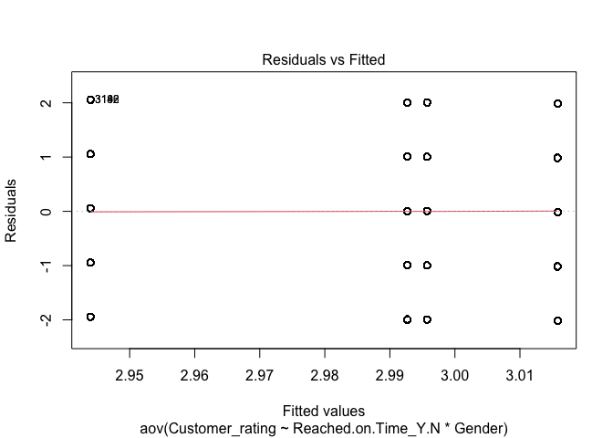
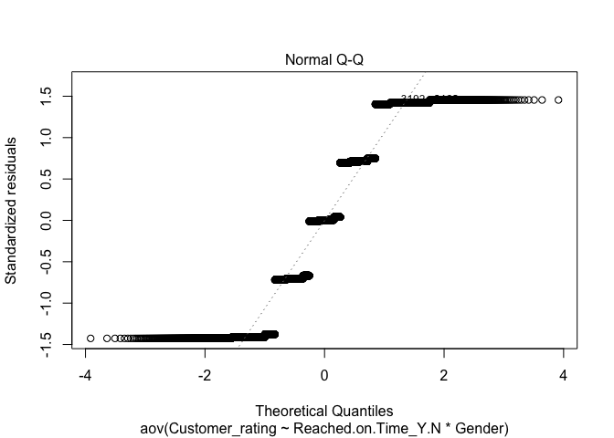

Stat with R, examples
================
Yi-Ju Tseng
2022-01-09

## Load packages

``` r
library(readr)
library(skimr)
library(dplyr)
```

## 1

The ship Titanic sank in 1912 with the loss of most of its passengers.
Details can be obtained on 1309 passengers and crew onboard the ship
Titanic.

[Dataset](https://www.sheffield.ac.uk/polopoly_fs/1.937210!/file/Titanic_R.csv)

[Description](https://www.sheffield.ac.uk/polopoly_fs/1.937209!/file/Titanic_data_description.docx)

``` r
Titanic_R <- read_csv("Titanic_R.csv")
```

### 1.a

1.  Among these passengers, are there age differences between the
    survived (survived=1) and the dead (survived=0) groups? Assume the
    population age is normally distributed. 請問存活與死亡的乘客的年紀是否有差？

<!-- end list -->

``` r
Titanic_R %>%
  group_by(survived) %>%
  skim(age)
```

|                                                  |            |
| :----------------------------------------------- | :--------- |
| Name                                             | Piped data |
| Number of rows                                   | 1309       |
| Number of columns                                | 15         |
| \_\_\_\_\_\_\_\_\_\_\_\_\_\_\_\_\_\_\_\_\_\_\_   |            |
| Column type frequency:                           |            |
| numeric                                          | 1          |
| \_\_\_\_\_\_\_\_\_\_\_\_\_\_\_\_\_\_\_\_\_\_\_\_ |            |
| Group variables                                  | survived   |

Data summary

**Variable type: numeric**

| skim\_variable | survived | n\_missing | complete\_rate |  mean |    sd |   p0 | p25 | p50 | p75 | p100 | hist  |
| :------------- | -------: | ---------: | -------------: | ----: | ----: | ---: | --: | --: | --: | ---: | :---- |
| age            |        0 |        190 |           0.77 | 30.55 | 13.92 | 0.33 |  21 |  28 |  39 |   74 | ▂▇▅▂▁ |
| age            |        1 |         73 |           0.85 | 28.92 | 15.06 | 0.17 |  20 |  28 |  38 |   80 | ▃▇▅▂▁ |

由敘述性統計可知死亡與存活的乘客年紀平均值分別為30.5 (13.9)和28.9
(15.1)，單看年紀平均存活組乘客年紀較低。為確認此兩組乘客的年紀是否有顯著差異，因個案數大於30，應符合中央極限定理，使用t-test。（z-test也行）

假設：常態分佈、變異數相等（z-test不用）

首先執行F-test檢定測試兩組資料變異數是否相等，虛無假設為兩組資料變異數相等，對立假設為兩組資料變異數不相等

``` r
var.test(age~survived,
       data=Titanic_R, 
         alternative = "two.sided")
```

    ## 
    ##  F test to compare two variances
    ## 
    ## data:  age by survived
    ## F = 0.85448, num df = 618, denom df = 426, p-value = 0.07538
    ## alternative hypothesis: true ratio of variances is not equal to 1
    ## 95 percent confidence interval:
    ##  0.7164577 1.0161939
    ## sample estimates:
    ## ratio of variances 
    ##          0.8544792

p-value為0.075，在alpha=0.05的前提下，無法拒絕虛無假設，意即無法拒絕兩者資料變異數相等的假設。

接著執行變異數相等的t-test，虛無假設為兩組資料年紀平均值相等，對立假設為兩組資料年紀平均值不相等

``` r
t.test(age~survived,
       data=Titanic_R,
       var.equal=T)
```

    ## 
    ##  Two Sample t-test
    ## 
    ## data:  age by survived
    ## t = 1.7964, df = 1044, p-value = 0.07271
    ## alternative hypothesis: true difference in means between group 0 and group 1 is not equal to 0
    ## 95 percent confidence interval:
    ##  -0.1501791  3.4044606
    ## sample estimates:
    ## mean in group 0 mean in group 1 
    ##        30.54537        28.91823

p-value為0.072，在alpha=0.05的前提下，無法拒絕虛無假設，意即無法拒絕兩者資料年紀平均數相等的假設。也就是說，存活的乘客與死亡乘客的年紀並無顯著不同。

### 1.b

2.  Among these passengers, are there age differences in the first-class
    cabin (pclass=1), second-class cabin (pclass=2), and third-class
    cabin (pclass=3) group? Assume the population variances of age in
    each level of class are the same. 請問三種艙等的乘客年紀是否有差？

<!-- end list -->

``` r
Titanic_R %>%
  group_by(pclass) %>%
  skim(age)
```

|                                                  |            |
| :----------------------------------------------- | :--------- |
| Name                                             | Piped data |
| Number of rows                                   | 1309       |
| Number of columns                                | 15         |
| \_\_\_\_\_\_\_\_\_\_\_\_\_\_\_\_\_\_\_\_\_\_\_   |            |
| Column type frequency:                           |            |
| numeric                                          | 1          |
| \_\_\_\_\_\_\_\_\_\_\_\_\_\_\_\_\_\_\_\_\_\_\_\_ |            |
| Group variables                                  | pclass     |

Data summary

**Variable type: numeric**

| skim\_variable | pclass | n\_missing | complete\_rate |  mean |    sd |   p0 | p25 | p50 | p75 | p100 | hist  |
| :------------- | -----: | ---------: | -------------: | ----: | ----: | ---: | --: | --: | --: | ---: | :---- |
| age            |      1 |         39 |           0.88 | 39.16 | 14.55 | 0.92 |  28 |  39 |  50 |   80 | ▁▆▇▆▁ |
| age            |      2 |         16 |           0.94 | 29.51 | 13.64 | 0.67 |  22 |  29 |  36 |   70 | ▂▇▇▂▁ |
| age            |      3 |        208 |           0.71 | 24.82 | 11.96 | 0.17 |  18 |  24 |  32 |   74 | ▂▇▃▁▁ |

由敘述性統計可知三個艙等的乘客年紀平均值分別為39.2
(14.5)、29.5(13.6)以及24.8(12.0)，單看年紀平均頭等艙的乘客年紀較長。

`假設：常態分佈、變異數相等`

為確認此不同艙等乘客的年紀是否有顯著差異，在變異數相等的前提下，使用one-way ANOVA test。

虛無假設為不同艙等的乘客年紀均相等，對立假設為至少兩者間不相等。

``` r
Titanic_R$pclass<-factor(Titanic_R$pclass)
model<-aov(age~pclass,
       data=Titanic_R)
summary(model)
```

    ##               Df Sum Sq Mean Sq F value Pr(>F)    
    ## pclass         2  37339   18670   108.3 <2e-16 ***
    ## Residuals   1043 179758     172                   
    ## ---
    ## Signif. codes:  0 '***' 0.001 '**' 0.01 '*' 0.05 '.' 0.1 ' ' 1
    ## 263 observations deleted due to missingness

由ANOVA結果可知，F值為108.3，p-value\<0.000001，在alpha=0.05的前提下，拒絕虛無假設，證明不同艙等乘客的年紀有顯著差異。

為了分出兩兩間差異，執行Tukey HSD事後比較，沒做事後比較會扣分

``` r
TukeyHSD(model)
```

    ##   Tukey multiple comparisons of means
    ##     95% family-wise confidence level
    ## 
    ## Fit: aov(formula = age ~ pclass, data = Titanic_R)
    ## 
    ## $pclass
    ##           diff        lwr        upr   p adj
    ## 2-1  -9.653213 -12.295286  -7.011140 0.0e+00
    ## 3-1 -14.343551 -16.632219 -12.054883 0.0e+00
    ## 3-2  -4.690338  -7.042484  -2.338191 9.7e-06

由事後檢定結果可知，在alpha=0.05的前提下，任兩組艙等的乘客年紀均有顯著差異。

### 1.c

3.  Among these passengers, are the survival status (survived) different
    among passengers in different levels of cabins (pclass)?
    乘客是否存活和乘坐的艙等是否有關？

<!-- end list -->

``` r
Titanic_R %>%
  mutate(survived=factor(survived)) %>%
  group_by(pclass) %>%
  skim(survived)
```

|                                                  |            |
| :----------------------------------------------- | :--------- |
| Name                                             | Piped data |
| Number of rows                                   | 1309       |
| Number of columns                                | 15         |
| \_\_\_\_\_\_\_\_\_\_\_\_\_\_\_\_\_\_\_\_\_\_\_   |            |
| Column type frequency:                           |            |
| factor                                           | 1          |
| \_\_\_\_\_\_\_\_\_\_\_\_\_\_\_\_\_\_\_\_\_\_\_\_ |            |
| Group variables                                  | pclass     |

Data summary

**Variable type: factor**

| skim\_variable | pclass | n\_missing | complete\_rate | ordered | n\_unique | top\_counts    |
| :------------- | :----- | ---------: | -------------: | :------ | --------: | :------------- |
| survived       | 1      |          0 |              1 | FALSE   |         2 | 1: 200, 0: 123 |
| survived       | 2      |          0 |              1 | FALSE   |         2 | 0: 158, 1: 119 |
| survived       | 3      |          0 |              1 | FALSE   |         2 | 0: 528, 1: 181 |

由敘述性統計可知，頭等艙存活人數大於死亡人數，而其他兩個艙等的死亡人數均大於存活人數。為驗證是否存活與艙等是否有關，這邊將艙等當成類別變項，因此艙等的順序資訊將不會納入此分析中，可能會有誤差。進行卡方檢定，滿足隨機且多項試驗的前提，且資料大，期望值均小於5。

`假設：期望值大於5，個數要夠大`

虛無假設為是否存活與艙等獨立（無關），對立假設為是否存活與艙等有關

``` r
chisq.test(table(Titanic_R$pclass,Titanic_R$survived))
```

    ## 
    ##  Pearson's Chi-squared test
    ## 
    ## data:  table(Titanic_R$pclass, Titanic_R$survived)
    ## X-squared = 127.86, df = 2, p-value < 2.2e-16

在alpha=0.05的前提下，p\<0.05，拒絕虛無假設，意即證明是否存活與艙等有關。

## 2

The Crime Rate data set gives a variety of variables by US state at two
time points 10 years apart.

[Dataset](https://www.sheffield.ac.uk/polopoly_fs/1.937192!/file/Crime_R.csv)

[Description](https://www.sheffield.ac.uk/polopoly_fs/1.937191!/file/Crime_data_summary.docx)

``` r
Crime <- read_csv("Crime_R.csv")
```

### 2.a

1.  Is the Crime Rate (CrimeRate) in the southern states (Southern=1)
    higher than the other states (Southern=0)? 在南方的州犯罪率(CrimeRate)
    是否比其他州高？

<!-- end list -->

``` r
Crime %>%
  group_by(Southern) %>%
  skim(CrimeRate)
```

|                                                  |            |
| :----------------------------------------------- | :--------- |
| Name                                             | Piped data |
| Number of rows                                   | 47         |
| Number of columns                                | 27         |
| \_\_\_\_\_\_\_\_\_\_\_\_\_\_\_\_\_\_\_\_\_\_\_   |            |
| Column type frequency:                           |            |
| numeric                                          | 1          |
| \_\_\_\_\_\_\_\_\_\_\_\_\_\_\_\_\_\_\_\_\_\_\_\_ |            |
| Group variables                                  | Southern   |

Data summary

**Variable type: numeric**

| skim\_variable | Southern | n\_missing | complete\_rate |   mean |    sd |   p0 |  p25 |    p50 |    p75 |  p100 | hist  |
| :------------- | -------: | ---------: | -------------: | -----: | ----: | ---: | ---: | -----: | -----: | ----: | :---- |
| CrimeRate      |        0 |          0 |              1 | 103.91 | 31.96 | 45.5 | 80.2 | 104.30 | 129.80 | 161.8 | ▃▇▇▆▅ |
| CrimeRate      |        1 |          0 |              1 | 100.68 | 22.59 | 56.6 | 94.0 | 101.45 | 112.65 | 145.4 | ▂▂▇▅▁ |

由敘述性統計可知在南方的州犯罪率為101(22.6)，非南方的州犯罪率為104(32.0)，單看犯罪率南方的州較低低。為確認此南方的州的犯罪率是否顯著比非南方的州高，兩組個案數\<30，母體是否為常態分佈未知，為使用t-test，假設母體為常態分佈。

`假設：常態分佈、變異數相等`

首先執行F-test檢定測試兩組資料變異數是否相等，虛無假設為兩組資料變異數相等，對立假設為兩組資料變異數不相等

``` r
var.test(CrimeRate~Southern,
       data=Crime, 
         alternative = "two.sided")
```

    ## 
    ##  F test to compare two variances
    ## 
    ## data:  CrimeRate by Southern
    ## F = 2.0016, num df = 30, denom df = 15, p-value = 0.1569
    ## alternative hypothesis: true ratio of variances is not equal to 1
    ## 95 percent confidence interval:
    ##  0.7571197 4.6180550
    ## sample estimates:
    ## ratio of variances 
    ##           2.001624

p-value為0.157，在alpha=0.05的前提下，無法拒絕虛無假設，意即無法拒絕兩者資料變異數相等的假設。

接著執行變異數相等的t-test，虛無假設為南方的州的犯罪率小於等於非南方的州，對立假設為南方的州的犯罪率是比非南方的州高，為單尾檢定

``` r
t.test(CrimeRate~Southern,
       data=Crime,
       var.equal=T,
       alternative = c("less"))
```

    ## 
    ##  Two Sample t-test
    ## 
    ## data:  CrimeRate by Southern
    ## t = 0.35917, df = 45, p-value = 0.6394
    ## alternative hypothesis: true difference in means between group 0 and group 1 is less than 0
    ## 95 percent confidence interval:
    ##      -Inf 18.30575
    ## sample estimates:
    ## mean in group 0 mean in group 1 
    ##        103.9065        100.6813

p-value為0.6394，在alpha=0.05的前提下，無法拒絕虛無假設，意即無法拒絕南方與非南方的州犯罪率相等的假設。也就是說，南方與非南方的州犯罪率並無顯著不同。

### 2.b

2.  Have crime rates increased in 10 years (CrimeRate vs. CrimeRate10)?
    比較各州資料，十年後的犯罪率是否比十年前高？

<!-- end list -->

``` r
summary(Crime$CrimeRate)
```

    ##    Min. 1st Qu.  Median    Mean 3rd Qu.    Max. 
    ##    45.5    82.7   103.0   102.8   120.7   161.8

``` r
summary(Crime$CrimeRate10)
```

    ##    Min. 1st Qu.  Median    Mean 3rd Qu.    Max. 
    ##   26.50   76.35  103.50  102.07  130.25  178.20

由敘述性統計可知十年前犯罪率為102.8，十年後犯罪率為102.07，單看犯罪率平均，十年前後並無太大差別。為確認此十年後的犯罪率是否顯著比十年前的犯罪率高，兩組個案數\>30，且犯罪率同州成對，使用paired
t-test。

`假設：差異為常態分佈`

虛無假設為十年後的犯罪率小於等於十年前，對立假設為十年後的犯罪率是比十年前高，為單尾檢定

``` r
t.test(x= Crime$CrimeRate,
      y=Crime$CrimeRate10,
      paired = T,
       alternative = c("less"))
```

    ## 
    ##  Paired t-test
    ## 
    ## data:  Crime$CrimeRate and Crime$CrimeRate10
    ## t = 0.47082, df = 46, p-value = 0.68
    ## alternative hypothesis: true difference in means is less than 0
    ## 95 percent confidence interval:
    ##      -Inf 3.370597
    ## sample estimates:
    ## mean of the differences 
    ##               0.7382979

p-value為0.68，在alpha=0.05的前提下，無法拒絕虛無假設，意即無法拒絕十年後的犯罪率小於等於十年前的假設。也就是說，十年後的犯罪率與十年前並無顯著不同。

### 2.c

3.  Divide the education time (Education) into high education time
    (\>13), median education time (\>11 and \<=13), and low education
    time (\<=11). Are the Crime Rate (CrimeRate) different among these
    education groups? Assume the population variances of Crime Rate are
    the same.將接受教育的時間長度分組，請問各組的犯罪率是否有差異呢？

先將接受教育的時間，依照題目要求長度分組

``` r
Edu<-Crime %>% 
  mutate(EduGroup = 
           cut(Education, breaks=c(0,11,13,100))) %>%
  select(Education,EduGroup,CrimeRate)
table(Edu$EduGroup)
```

    ## 
    ##   (0,11]  (11,13] (13,100] 
    ##        7       27       13

每組人數為7、27、13人

``` r
Edu %>%
  group_by(EduGroup) %>%
  skim(CrimeRate)
```

|                                                  |            |
| :----------------------------------------------- | :--------- |
| Name                                             | Piped data |
| Number of rows                                   | 47         |
| Number of columns                                | 3          |
| \_\_\_\_\_\_\_\_\_\_\_\_\_\_\_\_\_\_\_\_\_\_\_   |            |
| Column type frequency:                           |            |
| numeric                                          | 1          |
| \_\_\_\_\_\_\_\_\_\_\_\_\_\_\_\_\_\_\_\_\_\_\_\_ |            |
| Group variables                                  | EduGroup   |

Data summary

**Variable type: numeric**

| skim\_variable | EduGroup  | n\_missing | complete\_rate |   mean |    sd |   p0 |   p25 |   p50 |    p75 |  p100 | hist  |
| :------------- | :-------- | ---------: | -------------: | -----: | ----: | ---: | ----: | ----: | -----: | ----: | :---- |
| CrimeRate      | (0,11\]   |          0 |              1 |  98.39 | 22.98 | 52.3 | 97.10 |  99.9 | 107.55 | 127.2 | ▂▁▂▇▂ |
| CrimeRate      | (11,13\]  |          0 |              1 | 101.02 | 30.17 | 45.5 | 78.95 |  98.7 | 121.55 | 154.3 | ▅▇▇▆▆ |
| CrimeRate      | (13,100\] |          0 |              1 | 108.91 | 30.09 | 67.6 | 84.90 | 107.2 | 121.60 | 161.8 | ▆▂▇▂▃ |

單看每組犯罪率的平均，受教育時間長的組別犯罪率平均值大於其他兩組。但仍需做檢定判斷該差距是否具有統計意義。

`假設：常態分佈、變異數相等`

首先執行Bartlett’s test檢定接受教育的時間不同，犯罪率變異數是否相等，虛無假設為變異數相等，對立假設為至少兩種資料變異數不相等。

``` r
bartlett.test(CrimeRate~EduGroup,
         data=Edu)
```

    ## 
    ##  Bartlett test of homogeneity of variances
    ## 
    ## data:  CrimeRate by EduGroup
    ## Bartlett's K-squared = 0.63965, df = 2, p-value = 0.7263

p\>0.05，接受教育的時間不同，沒有足夠證據證明犯罪率的變異數不同，因此犯罪率變異數相同。

另外為了檢測各組商品價格是否為常態分佈，執行**Shapiro test**。

``` r
Edu %>%
  group_by(EduGroup) %>%
  summarise(statistic = shapiro.test(CrimeRate)$statistic,
            p.value = shapiro.test(CrimeRate)$p.value)
```

    ## # A tibble: 3 × 3
    ##   EduGroup statistic p.value
    ##   <fct>        <dbl>   <dbl>
    ## 1 (0,11]       0.856   0.140
    ## 2 (11,13]      0.975   0.750
    ## 3 (13,100]     0.946   0.533

p-value\>0.05，資料為常態分佈，做ANOVA test檢定接受教育的時間不同，犯罪率是否相同。這邊只要有寫到需要常態分佈即可。
虛無假設為接受教育的時間不同，犯罪率相同，對立假設是至少兩組犯罪率不同。

``` r
model<-aov(CrimeRate~EduGroup,
           data=Edu)
summary(model)
```

    ##             Df Sum Sq Mean Sq F value Pr(>F)
    ## EduGroup     2    707   353.5   0.413  0.664
    ## Residuals   44  37695   856.7

p-value\>0.05，也就是說在alpha=0.05的條件下，無法拒絕虛無假設，意即沒有證據證明接受教育的時間不同，犯罪率不同。

### 2.d

4.  Is there a relationship between high youth unemployment
    (HighYouthUnemploy) and southern states (Southern)?
    請問是否有高比例的青年失業和是不是南方的州有無關聯？

<!-- end list -->

``` r
Crime %>%
  mutate(HighYouthUnemploy=factor(HighYouthUnemploy)) %>%
  group_by(Southern) %>%
  skim(HighYouthUnemploy)
```

|                                                  |            |
| :----------------------------------------------- | :--------- |
| Name                                             | Piped data |
| Number of rows                                   | 47         |
| Number of columns                                | 27         |
| \_\_\_\_\_\_\_\_\_\_\_\_\_\_\_\_\_\_\_\_\_\_\_   |            |
| Column type frequency:                           |            |
| factor                                           | 1          |
| \_\_\_\_\_\_\_\_\_\_\_\_\_\_\_\_\_\_\_\_\_\_\_\_ |            |
| Group variables                                  | Southern   |

Data summary

**Variable type: factor**

| skim\_variable    | Southern | n\_missing | complete\_rate | ordered | n\_unique | top\_counts  |
| :---------------- | -------: | ---------: | -------------: | :------ | --------: | :----------- |
| HighYouthUnemploy |        0 |          0 |              1 | FALSE   |         2 | 0: 17, 1: 14 |
| HighYouthUnemploy |        1 |          0 |              1 | FALSE   |         2 | 0: 15, 1: 1  |

以敘述性統計來看，南方的州高青年失業率的狀況少（1:15），非南方的州高青年失業率的狀況則稍為嚴重（14:17）

`假設：期望值大於5，個數要夠大`

為檢定是否有高比例的青年失業和是不是南方的州有無關聯，由於人數較少，期望值可能小於5，因此不用卡方檢定，改使用**fisher
test**，虛無假設為是否有高比例的青年失業和是不是南方的州無關聯，對立假設則是有關

``` r
fisher.test(table(Crime$Southern,
                 Crime$HighYouthUnemploy))
```

    ## 
    ##  Fisher's Exact Test for Count Data
    ## 
    ## data:  table(Crime$Southern, Crime$HighYouthUnemploy)
    ## p-value = 0.008049
    ## alternative hypothesis: true odds ratio is not equal to 1
    ## 95 percent confidence interval:
    ##  0.001802563 0.684823421
    ## sample estimates:
    ## odds ratio 
    ## 0.08464662

得到p\<0.05，意即是否有高比例的青年失業和是不是南方的州有關聯

## 3

In the [JHU CSSE COVID-19
Dataset](https://github.com/CSSEGISandData/COVID-19)

In the global dataset, is the Fatality Ratio (Case\_Fatality\_Ratio) on
[2021/06/07](https://raw.githubusercontent.com/CSSEGISandData/COVID-19/master/csse_covid_19_data/csse_covid_19_daily_reports/06-06-2021.csv)
(file name 06-06-2021) lower than the Fatality Ratio on
[2021/05/07](https://raw.githubusercontent.com/CSSEGISandData/COVID-19/master/csse_covid_19_data/csse_covid_19_daily_reports/05-06-2021.csv)?
(file name 05-06-2021)
(description)以全球的資料來看，2021/06/07的疾病死亡比例是否有比2021/05/07的死亡比例低呢？

``` r
X06_06_2021 <- read_csv("06-06-2021.csv")
X05_06_2021 <- read_csv("05-06-2021.csv")
### check number of rows
nrow(X06_06_2021)
```

    ## [1] 3984

``` r
nrow(X05_06_2021)
```

    ## [1] 3984

2021/05/07和2021/06/07全球的COVID-19疫情資料，各有3984筆資料。

``` r
### keep the columns we need for analysis 
X06_06_2021Short<-X06_06_2021 %>% 
  select(Combined_Key,Case_Fatality_Ratio) %>%
  rename(Case_Fatality_Ratio0606=Case_Fatality_Ratio)
X05_06_2021Short<-X05_06_2021 %>% 
  select(Combined_Key,Case_Fatality_Ratio)%>%
  rename(Case_Fatality_Ratio0506=Case_Fatality_Ratio)

### merge 2 tables to make sure the incident rates are paired 
MergedTable<-inner_join(X05_06_2021Short,
                        X06_06_2021Short,
                        by=c("Combined_Key"))

### check number of rows after merged 2 tables 
nrow(MergedTable)
```

    ## [1] 3984

合併兩個日期的資料，用地區名稱作配對依據。

``` r
### remove missing value 
MergedTable<-MergedTable[complete.cases(MergedTable),]
nrow(MergedTable)
```

    ## [1] 3941

兩資料集均有45筆遺漏值，刪除遺漏值後，資料各有3941筆

``` r
### descriptive analysis 
MergedTable %>%
  skim(Case_Fatality_Ratio0506,Case_Fatality_Ratio0606)
```

|                                                  |            |
| :----------------------------------------------- | :--------- |
| Name                                             | Piped data |
| Number of rows                                   | 3941       |
| Number of columns                                | 3          |
| \_\_\_\_\_\_\_\_\_\_\_\_\_\_\_\_\_\_\_\_\_\_\_   |            |
| Column type frequency:                           |            |
| numeric                                          | 2          |
| \_\_\_\_\_\_\_\_\_\_\_\_\_\_\_\_\_\_\_\_\_\_\_\_ |            |
| Group variables                                  | None       |

Data summary

**Variable type: numeric**

| skim\_variable            | n\_missing | complete\_rate | mean |   sd | p0 |  p25 |  p50 |  p75 |   p100 | hist  |
| :------------------------ | ---------: | -------------: | ---: | ---: | -: | ---: | ---: | ---: | -----: | :---- |
| Case\_Fatality\_Ratio0506 |          0 |              1 | 2.04 | 2.76 |  0 | 1.21 | 1.76 | 2.48 | 127.30 | ▇▁▁▁▁ |
| Case\_Fatality\_Ratio0606 |          0 |              1 | 2.08 | 2.70 |  0 | 1.22 | 1.78 | 2.50 | 122.24 | ▇▁▁▁▁ |

平均Case Fatality Ratio分別為2.04(sd=2.76)和2.08(sd=2.7)，中位數為1.76和1.78
。單純由平均值或是中位數來看，2021/06/07的疾病死亡率比2021/05/07的疾病死亡率高。

``` r
shapiro.test(MergedTable$Case_Fatality_Ratio0606-
               MergedTable$Case_Fatality_Ratio0506)
```

    ## 
    ##  Shapiro-Wilk normality test
    ## 
    ## data:  MergedTable$Case_Fatality_Ratio0606 - MergedTable$Case_Fatality_Ratio0506
    ## W = 0.14964, p-value < 2.2e-16

`假設：差距為常態分佈`

檢查死亡率的差距是否是常態分佈，使用shapiro test (老師補充，可做可不做)得到的結論都是此資料非常態分佈（P\<0.05）

``` r
### perform paired t-test
t.test(x=MergedTable$Case_Fatality_Ratio0606,
       y=MergedTable$Case_Fatality_Ratio0506,
       paired = T,
       alternative = "less")
```

    ## 
    ##  Paired t-test
    ## 
    ## data:  MergedTable$Case_Fatality_Ratio0606 and MergedTable$Case_Fatality_Ratio0506
    ## t = 4.3686, df = 3940, p-value = 1
    ## alternative hypothesis: true difference in means is less than 0
    ## 95 percent confidence interval:
    ##        -Inf 0.05736558
    ## sample estimates:
    ## mean of the differences 
    ##              0.04167179

雖然不是常態分佈，但在沒交過其他方法的情況下，還是執行paired t-test，使用的是單尾檢定（alternative =
“greater”，意義為x greater than y），且設定paired = T，指定作配對的檢定。根據輸出結果，t =
-4.3686，df = 3940，P-value =
1，我們無法拒絕H0，也就是沒有證據證明2021/06/07的疾病死亡率比2021/05/07的疾病死亡率低。

``` r
### perform paired Wilcoxon signed-rank test
wilcox.test(x=MergedTable$Case_Fatality_Ratio0606,
            y=MergedTable$Case_Fatality_Ratio0506, 
            paired = TRUE, 
            alternative = "less")
```

    ## 
    ##  Wilcoxon signed rank test with continuity correction
    ## 
    ## data:  MergedTable$Case_Fatality_Ratio0606 and MergedTable$Case_Fatality_Ratio0506
    ## V = 3819825, p-value = 1
    ## alternative hypothesis: true location shift is less than 0

（老師補充）不是常態分佈，所以執行Wilcoxon signed-rank
test，根據輸出結果P=1，我們無法拒絕H0，也就是沒有證據證明2021/06/07的疾病死亡率比2021/05/07的疾病死亡率低。

## 4

An international e-commerce company based wants to discover key insights
from its customer database. The company sells electronic products.
([dataset](https://drive.google.com/file/d/1sDzxspZ3wi1YTdSg7w2qnM--bkvK6r84/view?usp=sharing)
from Kaggle)

``` r
Train <- read_csv("Train.csv")
```

### 4.a

1.  Is the customer rating (Customer\_rating) associated with if the
    products reached on time (Reached.on.Time\_Y.N) and customer gender
    (Gender)? That is, please test if the customer rating affected by
    reached on-time status and customer gender. 顧客評分跟貨品有沒有準時到還有顧客性別是否有關？

<!-- end list -->

``` r
Train %>%
  group_by(Reached.on.Time_Y.N,Gender) %>%
  skim(Customer_rating)
```

|                                                  |                              |
| :----------------------------------------------- | :--------------------------- |
| Name                                             | Piped data                   |
| Number of rows                                   | 10999                        |
| Number of columns                                | 12                           |
| \_\_\_\_\_\_\_\_\_\_\_\_\_\_\_\_\_\_\_\_\_\_\_   |                              |
| Column type frequency:                           |                              |
| numeric                                          | 1                            |
| \_\_\_\_\_\_\_\_\_\_\_\_\_\_\_\_\_\_\_\_\_\_\_\_ |                              |
| Group variables                                  | Reached.on.Time\_Y.N, Gender |

Data summary

**Variable type: numeric**

| skim\_variable   | Reached.on.Time\_Y.N | Gender | n\_missing | complete\_rate | mean |   sd | p0 | p25 | p50 | p75 | p100 | hist  |
| :--------------- | -------------------: | :----- | ---------: | -------------: | ---: | ---: | -: | --: | --: | --: | ---: | :---- |
| Customer\_rating |                    0 | F      |          0 |              1 | 2.94 | 1.42 |  1 |   2 |   3 |   4 |    5 | ▇▇▇▇▇ |
| Customer\_rating |                    0 | M      |          0 |              1 | 2.99 | 1.41 |  1 |   2 |   3 |   4 |    5 | ▇▇▇▇▇ |
| Customer\_rating |                    1 | F      |          0 |              1 | 3.02 | 1.41 |  1 |   2 |   3 |   4 |    5 | ▇▇▇▇▇ |
| Customer\_rating |                    1 | M      |          0 |              1 | 3.00 | 1.41 |  1 |   2 |   3 |   4 |    5 | ▇▇▇▇▇ |

單看四組資料，並無太大差異。

`假設：常態分佈、變異數相等、各組別個案數一樣`

首先執行Bartlett’s
test檢定根據貨品有沒有準時到還有顧客性別分組後，各組顧客評分變異數是否相等，虛無假設為變異數相等，對立假設為至少兩組資料變異數不相等。

``` r
Train$Groups<-paste(Train$Reached.on.Time_Y.N,Train$Gender)
bartlett.test(Customer_rating~Groups,
              data=Train)
```

    ## 
    ##  Bartlett test of homogeneity of variances
    ## 
    ## data:  Customer_rating by Groups
    ## Bartlett's K-squared = 0.19479, df = 3, p-value = 0.9784

因p-value\>0.05，沒有證據證明變異數不相等，意即變異數相等。

另外為了檢測各組商品價格是否為常態分佈，執行**Shapiro test**。

``` r
Train %>%
  group_by(Reached.on.Time_Y.N,Gender) %>%
  summarise(count=n(),
            statistic = shapiro.test(Customer_rating)$statistic,
            p.value = shapiro.test(Customer_rating)$p.value)
```

    ## `summarise()` has grouped output by 'Reached.on.Time_Y.N'. You can override using the `.groups` argument.

    ## # A tibble: 4 × 5
    ## # Groups:   Reached.on.Time_Y.N [2]
    ##   Reached.on.Time_Y.N Gender count statistic  p.value
    ##                 <dbl> <chr>  <int>     <dbl>    <dbl>
    ## 1                   0 F       2249     0.886 8.14e-38
    ## 2                   0 M       2187     0.889 4.45e-37
    ## 3                   1 F       3296     0.888 8.87e-44
    ## 4                   1 M       3267     0.889 1.49e-43

p-value\<0.05，資料看起來不像常態分佈，但沒學過非常態分佈的方法，只好還是做two-way ANOVA
test檢定根據貨品有沒有準時到還有顧客性別分組後，各組顧客評分是否相等。這邊只要有寫到需要常態分佈即可。
虛無假設為根據貨品有沒有準時到還有顧客性別分組後，各組顧客評分相等，對立假設則是至少兩組不相等。

``` r
res.aov2 <- 
  aov(Customer_rating ~ Reached.on.Time_Y.N * Gender, 
      data = Train)
summary(res.aov2)
```

    ##                               Df Sum Sq Mean Sq F value Pr(>F)
    ## Reached.on.Time_Y.N            1      4   3.782   1.893  0.169
    ## Gender                         1      0   0.162   0.081  0.776
    ## Reached.on.Time_Y.N:Gender     1      3   3.129   1.566  0.211
    ## Residuals                  10995  21970   1.998

p-value\>0.05，也就是說在alpha=0.05的條件下，無法拒絕虛無假設，意即沒有證據證明根據貨品有沒有準時到還有顧客性別分組後，各組顧客評分不同。

（老師補充）在做完ANOVA後，也可以從模型看出樣本是否符合變異數相等和常態分佈的假設，做圖如下：

``` r
plot(res.aov2, 1)
```

<!-- -->

outliers會被標出（31, 32等），不符合同質性

``` r
plot(res.aov2, 2)
```

<!-- -->

殘差QQ圖也可看出樣本不符合常態分佈。

（老師補充2）在two-way
ANOVA中，其實希望各treatment的樣本數相同，這題的樣本數大概是2:2:3:3，要做unbalanced
Two-Factor ANOVA test，搭配Type-III sums of squares，這也是要稍微進階的統計課才會教，範例如下：

``` r
library(car)
```

    ## Loading required package: carData

    ## 
    ## Attaching package: 'car'

    ## The following object is masked from 'package:dplyr':
    ## 
    ##     recode

``` r
my_anova <- 
  aov(Customer_rating~Reached.on.Time_Y.N*Gender, 
      data = Train)
Anova(my_anova, type = "III")
```

    ## Anova Table (Type III tests)
    ## 
    ## Response: Customer_rating
    ##                             Sum Sq    Df   F value  Pr(>F)    
    ## (Intercept)                19492.1     1 9754.9268 < 2e-16 ***
    ## Reached.on.Time_Y.N            6.9     1    3.4491 0.06331 .  
    ## Gender                         2.6     1    1.3165 0.25124    
    ## Reached.on.Time_Y.N:Gender     3.1     1    1.5660 0.21081    
    ## Residuals                  21969.9 10995                      
    ## ---
    ## Signif. codes:  0 '***' 0.001 '**' 0.01 '*' 0.05 '.' 0.1 ' ' 1

### 4.b

2.  Is the cost of the product (Cost\_of\_the\_Product) different among
    the mode of shipment (Mode\_of\_Shipment)? 使用不同運送方式的貨品商品價格是否不同？

<!-- end list -->

``` r
Train %>%
  group_by(Mode_of_Shipment) %>%
  skim(Cost_of_the_Product)
```

|                                                  |                    |
| :----------------------------------------------- | :----------------- |
| Name                                             | Piped data         |
| Number of rows                                   | 10999              |
| Number of columns                                | 13                 |
| \_\_\_\_\_\_\_\_\_\_\_\_\_\_\_\_\_\_\_\_\_\_\_   |                    |
| Column type frequency:                           |                    |
| numeric                                          | 1                  |
| \_\_\_\_\_\_\_\_\_\_\_\_\_\_\_\_\_\_\_\_\_\_\_\_ |                    |
| Group variables                                  | Mode\_of\_Shipment |

Data summary

**Variable type: numeric**

| skim\_variable         | Mode\_of\_Shipment | n\_missing | complete\_rate |   mean |    sd | p0 | p25 | p50 | p75 | p100 | hist  |
| :--------------------- | :----------------- | ---------: | -------------: | -----: | ----: | -: | --: | --: | --: | ---: | :---- |
| Cost\_of\_the\_Product | Flight             |          0 |              1 | 209.31 | 48.23 | 96 | 169 | 214 | 250 |  310 | ▂▆▆▇▂ |
| Cost\_of\_the\_Product | Road               |          0 |              1 | 210.48 | 47.60 | 97 | 169 | 216 | 251 |  310 | ▂▆▆▇▃ |
| Cost\_of\_the\_Product | Ship               |          0 |              1 | 210.34 | 48.14 | 96 | 170 | 214 | 251 |  310 | ▂▆▆▇▃ |

為比較不同運送方式的貨品商品價格是否不同，先做敘述性統計，發現空運、陸運以及船運的商品價格平均分別為209(48.2)、210(47.6)、210(48.1)，單比較平均值看不出太大差異。

`假設：常態分佈、變異數相等`

首先執行Bartlett’s
test檢定不同運送方式的貨品商品價格變異數是否相等，虛無假設為不同運送方式的貨品商品價格變異數相等，對立假設為至少兩種資料變異數不相等。

``` r
bartlett.test(Cost_of_the_Product~Mode_of_Shipment,
         data=Train)
```

    ## 
    ##  Bartlett test of homogeneity of variances
    ## 
    ## data:  Cost_of_the_Product by Mode_of_Shipment
    ## Bartlett's K-squared = 0.40239, df = 2, p-value = 0.8178

p-value為0.82，大於alpha=0.05，因此沒有證據證明變異數不同。

另外為了檢測各組商品價格是否為常態分佈，執行**Anderson-Darling normality test**，因為**Shapiro
test**不能用在超過5000筆資料上。

``` r
library(nortest)
Train %>%
  group_by(Mode_of_Shipment) %>%
  summarise(statistic = ad.test(Cost_of_the_Product)$statistic,
            p.value = ad.test(Cost_of_the_Product)$p.value)
```

    ## # A tibble: 3 × 3
    ##   Mode_of_Shipment statistic p.value
    ##   <chr>                <dbl>   <dbl>
    ## 1 Flight                16.8 3.7e-24
    ## 2 Road                  18.4 3.7e-24
    ## 3 Ship                  70.1 3.7e-24

p-value\<0.05，資料看起來不像常態分佈，但沒學過非常態分佈的方法，只好還是做ANOVA
test檢定不同運送方式的貨品商品價格是否相同。這邊只要有寫到需要常態分佈即可。
虛無假設定不同運送方式的貨品商品價格相同，對立假設是至少兩組商品價格不同。

``` r
res.aov1 <- 
  aov(Cost_of_the_Product ~ Mode_of_Shipment, data = Train)
summary(res.aov1)
```

    ##                     Df   Sum Sq Mean Sq F value Pr(>F)
    ## Mode_of_Shipment     2     1704   852.2   0.369  0.692
    ## Residuals        10996 25404535  2310.3

p-value\>0.05，也就是說在alpha=0.05的條件下，無法拒絕虛無假設，意即沒有證據證明不同運送方式的貨品商品價格不同。

（老師補充）若不符合常態分佈的假設，其實可用**Kruskal-Wallis Test**，範例如下：

``` r
kruskal.test(Cost_of_the_Product ~ Mode_of_Shipment, data = Train)
```

    ## 
    ##  Kruskal-Wallis rank sum test
    ## 
    ## data:  Cost_of_the_Product by Mode_of_Shipment
    ## Kruskal-Wallis chi-squared = 0.52846, df = 2, p-value = 0.7678

可以看出會得到差不多的結論（因為p值很大，怎樣保守估計都不太會影響結論）
